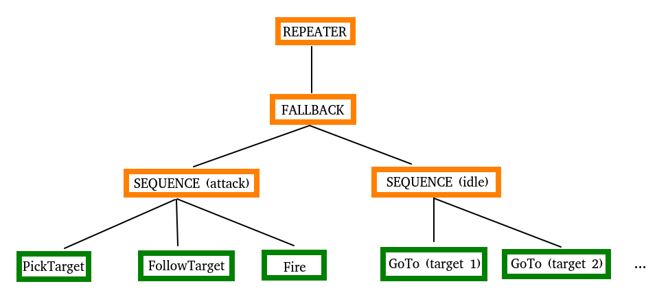
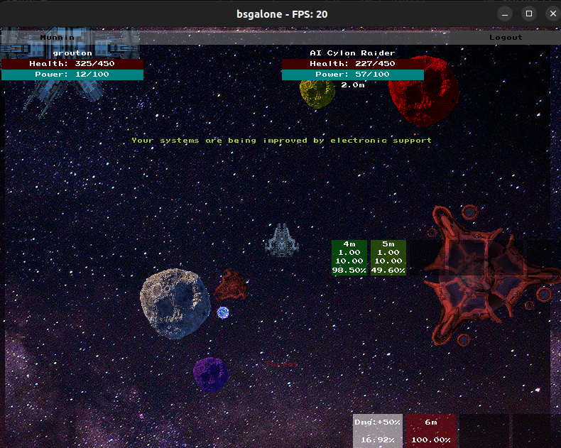

# bsgalone

Yet another copy of a famous game which will be probably not as polished and not as fun as the original. This time we try out: BSGO.

# What is the game about?

The goal is to have a 2d top view space shooter where the user can travel from systems to systems and fight enemies while mining resources and upgrading their ship.

# Installation

## Prerequisite

This projects uses:

- [google test](https://github.com/google/googletest): installation instructions [here](https://www.eriksmistad.no/getting-started-with-google-test-on-ubuntu/), a simple `sudo apt-get install libgtest-dev` should be enough.
- [cmake](https://cmake.org/): installation instructions [here](https://askubuntu.com/questions/355565/how-do-i-install-the-latest-version-of-cmake-from-the-command-line), a simple `sudo apt-get cmake` should also be enough.
- [eigen](https://eigen.tuxfamily.org/index.php?title=Main_Page): installation instructions [here](https://www.cyberithub.com/how-to-install-eigen3-on-ubuntu-20-04-lts-focal-fossa/) for Ubuntu 20.04, a simple `sudo apt install libeigen3-dev` should be enough.
- [libpqxx](https://github.com/jtv/libpqxx) for db connection. See installation instructions [here](https://github.com/jtv/libpqxx/blob/master/BUILDING-cmake.md#option-b-make-use-of-a-separately-installed-libpqxx) in the README of the github repository.
- [golang migrate](https://github.com/golang-migrate/migrate/blob/master/cmd/migrate/README.md): following the instructions there should be enough.
- postgresql which can be taken from the packages with `sudo apt-get install postgresql-14` for example.

## Instructions

- Clone the repo: `git clone git@github.com:Knoblauchpilze/pge-app.git`.
- Clone dependencies:
  - [core_utils](https://github.com/Knoblauchpilze/core_utils)
  - [maths_utils](https://github.com/Knoblauchpilze/maths_utils)
- Go to the project's directory `cd ~/path/to/the/repo`.
- Compile: `make run`.

Don't forget to add `/usr/local/lib` to your `LD_LIBRARY_PATH` to be able to load shared libraries at runtime. This is handled automatically when using the `make run` target (which internally uses the [run.sh](data/run.sh) script).

### libpqxx

The [README](https://github.com/jtv/libpqxx/blob/master/BUILDING-cmake.md) in the repo is not exactly working. You need to install `libpq-dev`: while not indicated it is clear from the build process.

Then the commands are not as described [here](https://github.com/jtv/libpqxx/blob/master/BUILDING-cmake.md#building-and-installing-libpqxx-yourself) but rather:
```bash
mkdir build
cd build
cmake -DCMAKE_CXX_STANDARD=20 -DCMAKE_BUILD_TYPE=Release -DBUILD_SHARED_LIBS=1 ..
make -j 8
sudo cmake --install .
```

Those were taken from [this](https://preshing.com/20170511/how-to-build-a-cmake-based-project/#running-cmake-from-the-command-line) tutorial and [this](https://stackoverflow.com/questions/67425557/how-do-i-build-a-cmake-project) Stack Overflow post. By default libpqxx generates a static library which is not really suited for our purposes. The option `BUILD_SHARED_LIBS` forces to create them. This was indicated in the [README](https://github.com/jtv/libpqxx/blob/master/BUILDING-cmake.md#cheat-sheet). Also the c++20 standard comes from [this issue](https://github.com/jtv/libpqxx/issues/732) as we encountered the same problem when building with the debug version.

Then we can attach the library as a dependency of the project as described in the rest of the install [guide](https://github.com/jtv/libpqxx/blob/master/BUILDING-cmake.md#option-b-make-use-of-a-separately-installed-libpqxx).

# Setting up the DB

## Install postgresql

To do this, install postgresql through the packages with:
```bash
sudo apt-get install postgresql-14
```

## How to send commands to the postgres server

In order to create the database and then perform the migration, we need to use at least once the default `postgres` user to create a new one. This new user will then be used to perform all the rest.

On first inspection it seems like to do that we need to authenticate with the `postgres` user. The first thing which was not working as easily as we thought is that running the default `psql` command is trying to connect using Unix sockets which are apparently configured to use peer authentication. This can be checked in the file `/etc/postgresql/14/main/pg_hba.conf`:

```
local   all             postgres                                peer
```

According to this [Stack Overflow post](https://stackoverflow.com/questions/66915087/postgresql-psql-error-fatal-peer-authentication-failed-for-user-userrole) a way to change this behavior is either to change the `peer` value to something else or to use TCP for example by adding `-h 127.0.0.1` or `-h localhost` as an option of the command line.

## Altering the postgres password

The second problem that arised was that once we were able to communicate with TCP, we were prompted the `postgres` user password. This is not known to us. This [Stack Overflow post](https://stackoverflow.com/questions/27107557/what-is-the-default-password-for-postgres) provided useful guidance to change it to something we know.

## Creating the database

Once all of the above is done, we can successfully run the provided scripts to create a user (see [create_user.sh](database/create_user.sh)) first and then use this user to create the database with [create_database.sh](database/create_database.sh).

## Populating the database

We use `migrate` to manage the database and perform the data migrations. Once the previous step is complete (so the user and the database both exist) one can simply go to the [migrations](database/migrations) folder and run:
```bash
make migrate
```

**On a fresh database**, this will trigger all the migrations in order. If the database is in an intermediate state then it will only run the missing migrations.

## Managing the database

Once the database is created, it is easy to add migration files in the folder and run again `make migrate` to apply them. If one of them needs to be reverted, `make demigrateO` can be used to undo the last migration while `make demigrate` will undo all the migrations and basically restore the database to its initial (empty) state.

## Drop the database

In case it is required to drop the database completely, a convenience script is available under [drop_database.sh](database/drop_database.sh). It is possible to recreate the database again by following the same procedure starting from the top [section](#creating-the-database).

## Creating migrations and generating uuids

According to this [Stack Overflow](https://stackoverflow.com/questions/72144228/sequelize-migration-throws-error-function-uuid-generate-v4-does-not-exist) question it seems like we can directly use `gen_random_uuid` with versions of postgres more recent than 14. This is our case.

Another approach as we need to deserialize the data from the database is to use plain integers for identifiers. This is probably enough for now. To this end it seems like the way to go about it is to use `generated always as identity` (taken from this [Stack Overflow](https://stackoverflow.com/questions/55300370/postgresql-serial-vs-identity) post).

# Development log and findings

## Goal

The goal of the game is to try to mimic some aspects of [Battlestar Galactica Online](https://www.mmorpg.com/battlestar-galactica-online) until we decide to actually move away from it.

It is similar in having players fight with each other in space ships. It is different in the sense that it is a 2d game.

We aim at progressively transition from a single computer, local game to a multiplayer online game while learning in the meantime how to do it.

## AI of bots

It seems there are two main ways to handle AI for NPCs:
* behavior trees
* state machines

### Behavior trees

While searching for some resources, we gathered the following collection of articles:
* one on [gamedeveloper](https://www.gamedeveloper.com/programming/behavior-trees-for-ai-how-they-work).
* one on the root website of the approach (as it seems :D) at [behaviortree.dev](https://www.behaviortree.dev/).
* and of course on [wikipedia](https://en.wikipedia.org/wiki/Behavior_tree_(artificial_intelligence,_robotics_and_control)).

### State machines

State machines seem pretty linked to Unity which probably has an implementation of them. The collection of articles below present the concept:
* one explaining how it works [in Unity](https://pavcreations.com/finite-state-machine-for-ai-enemy-controller-in-2d/2/#Activity-class).
* this one without Unity over at [tutsplus](https://code.tutsplus.com/finite-state-machines-theory-and-implementation--gamedev-11867t).
* this [one](https://www.gamedeveloper.com/programming/designing-a-simple-game-ai-using-finite-state-machines) is similar to the previous one but simpler.

### Decision

For our purposes it seems like both things could work:
* state machines might be easier if it's easy to come up with all the states beforehand: then it's clear what are the transitions and what can happen in any state.
* decision trees might require a more careful definition of what can happen in which scenario. The fallback mechanisms are also not as clear as with the state machine where it's just transitioning to another state: here we would have to go up the hierarchy and see what to do.

After pondering a bit, we decided to go for behavior tree. The state machine seems similar to how we already approached AI in the past so maybe it's a good idea to try something new.

### Current state of the AI

The idea behind the behavior tree is to have a list of nodes arranged in a graph. They are executed at each step which allows to easily react to new situations. Contraty to state machines, we don't have to think about switching from any state to any other state: at each frame we just start from the root again and see which state we end up with when the execution of the tree is finished.

The following image shows an example of how the very simplistic AI works at the moment:



In this example the root node is a repeater: this is usually advised as then we have an infinite behavior. We then have two main mode: the attack mode and the idle mode. Both of them are composed of a succession of actions. These are composed together with a fallback node, meaning that if the first strategy fail we will go on with the second one.

#### Attack mode

In the attack mode, the first thing is to pick a target: to that purpose the AI will scan its surroundings for a valid target. Two main results: success or failure.

In case it succeeds, we continue to the next: the AI will try to follow the target. This action just takes into consideration the target and tries to come closer to it: it succeeds immediately but also work iteratively. After this the Fire mode will be triggered which will check if the AI is close enough to the target and try to shoot at it.

In case it fails, then the parent sequence node will also fail as one of its child couldn't succeed and the repreater will then go on to the next element.

#### Idle mode

At any point the attack mode can fail: for example if the target goes too far from the AI, or if there's no target in the first place. In this case we count on the fallback node to start the idle mode.

The idle mode is composed of a succession of node to go to a target. This defines a patrol for the AI to loop through while waiting for something to happen.

This mode can't fail: the AI will just loop indefinitely until something else happens.

#### Orchestration

At each loop of the game we just iterate over the whole tree again. Usually it is advised to keep the processing time of nodes small so that it's not an issue to iterate over them very often.

Due to the dynamic nature of the tree and the fact that we iterate over it all the time, we can very easily react to a change:
* we're in idle mode but a target arrives? The attack mode will trigger itself on its own because the `PickTarget` node will suddenly return a valid target.
* we're shooting at the enemy but it dies? The next iteration will fail to find a target and we go back to idle mode.

This is much easier than having the AI in a certain state and then having at the very beginning of each state to do something like:
```cpp
if (determineState() != m_currentState) {
  return otherStateMethod();
}
```

It keeps the reactions of the AI dynamic by codifying them into the structure of the tree.

## Entity Component System

In order to represent the various elements of the game and their properties, we decided to implement an [entity component system](https://en.wikipedia.org/wiki/Entity_component_system).

The goal of this mechanism is to avoid the deeply nested class hierarchy common when developing a game. We already tried this approach when dealing with the agents (see the [agents](https://github.com/KnoblauchPilze/agents) repository).

While researching how to implement it we found this blog [codingwiththomas](https://www.codingwiththomas.com/blog/an-entity-component-system-from-scratch) which presents the implementation of such a system from scratch. It is well documented and explains the concept in quite some details.

In comparison with the `agents` project we decide to follow the paradigm a bit better and actually created some systems and a way to iterate through the entities.

### Entity

The [Entity](src/lib/bsgo/entities/Entity.hh) is the base class and is basically just an identifier with a list of components. We just added some convenience methods to assess the existence of some component and access them in a secure way.

### Component

A [Component](src/lib/bsgo/components/IComponent.hh) is the base class for all components. It just defines one basic method to update the component with some elapsed time. This might or might not be useful to the inheriting components but allows to have some quantity varying over time.

The goal of the implementation is to keep away the processing from the components in favour of putting all of them in the systems.

### System

A [System](src/lib/bsgo/systems/ISystem.hh) is iterating over the entities and only processing the ones that are interesting. Our implementation defines an `AbstractSystem` which aims at iterating over the entities.

The constructor expects the inheriting classes to pass a callback which will be used to filter the entities and keep only the ones that are interesting for the system. This typically involves checking if an entity has some components which are handled by the system.

Typically if an entity defines a [HealthComponent](src/lib/bsgo/components/HealthComponent.hh) we expect it to be processed by the [HealthSystem](src/lib/bsgo/systems/HealthSystem.hh).

## Database interaction

In the [clone of ogame](https://github.com/KnoblauchPilze/sogserver) we put most of the logic to interact with the database in stored procedures. The problem was that it was quite cumbersome to make some validation on the input data and also to get back any error that might happen during the insertion.

For this project we wanted to revisit this hypothesis and see if it was relatively widely used or not. The findings can be summarized in these two articles:
* [Stored Procedures a bad practice at one of worlds largest IT software consulting firms?](https://softwareengineering.stackexchange.com/questions/65742/stored-procedures-a-bad-practice-at-one-of-worlds-largest-it-software-consulting)
* [Business Layer in Database logic system](https://softwareengineering.stackexchange.com/questions/325488/business-layer-in-database-logic-system)

It seems like this can be justified to sometimes have a bit of logic in the database but should (based on these two examples) be avoided.

In this context, we implemented a business logic layer which aims at separating the concerns to update the database and how to do it. Typically each action that the user can take usually involves multiple operations in the database. For example signing up means:
* registering the player
* adding some starting resources/gear
* register at least one ship
* set the current system of the ship to the starting system

This is probably why it's not popular to put all of this logic in a stored procedure: it is quite complex and can get messy really fast when writing it in the language of the procedure. It is also not easy to debug or validate parameters within the procedures. On the other hand we can very easily do this if we keep a business logic layer in the application.

We chose to use a concept of services, all inheriting from a base [IService](src/lib/bsgo/services/IService.hh) class: there's a service for each kind of action (for example signing up, purchasing an item, etc.). Each of them define the conditions to meet for an action to be allowed, and the logic to actually perform the action.

Later on, it can also be relatively easily be extended to not do all the validations locally but rather by contacting a remote server.

**Note:** for now we don't use a single transaction to perform a complete action. This probably needs to be changed in the future to not leave the database in an inconsistent state.

## Interaction between the database and the ECS

### The problem statement

When the user is playing, there are some interactions which need to be persisted to the database. This will ultimately mean sending these commands through the network to the server which can then make the necessary verifications before allowing them.

A typical example is the jump. When the user selects a destination and initiates a jump, we register this in one of the component of the ship and decrement the countdown until it reaches zero. We have to persist the information that the ship is jumping somehow to the database but this information is within a component of the ECS.

Another example is when a player mines an asteroid and is supposed to gain some resources. This also relates to dealing damage in the first place and also killing an entity. These changes of state should be communicated to the database (and to the server) from within the ECS.

### Research

A straightforward solution is to make the systems aware of the database and just let them save whatever data they assume is meaningful to it. This has the benefit that it is simple to implement.

However thinking a bit ahead, what is supposed to happen when we will split the application into client/server? It seems like essentially every system would have to handle the networking aspect of getting data from the server and potentially patching whathever discrepencies might be detected between local and remote data.

We could find a bunch of relevant links on how to deal with this on the internet.

In [How to sync entities in an ecs game](https://gamedev.stackexchange.com/questions/178469/how-to-sync-entities-in-an-ecs-game) and [Networking with entity component system](https://www.reddit.com/r/gamedev/comments/5oib5v/networking_with_entity_component_system/) the recommendation is to use a `NetworkSynComponent` or something similar. The idea in each case is to have some dedicated `NetworkSystem` which takes care of receiving data and updated the entities which have a network component. The network component can presumably be either very stupid (just flagging the entity as having some form of networking aspect) or a bit smarter and define for example the properties of other components needing to be synced.

The topic in [How to network this entity system](https://gamedev.stackexchange.com/questions/21032/how-to-network-this-entity-system) does not recommend to go for a 'smart' network component as this is essentially mirroring what already exists in other components. Instead it seems like the approach would then be to have the `NetworkSystem` be able to deal with each component in a way similar to:
* check if the entity has a network aspect
* if yes iterates over all registered component
* for each component call an internal method that indicates which properties need to be updated and how

One drawback of this is that the `NetworkSystem` will grow quite a bit due to handling all the components we have in the game. The plus is that there's a single place which should deal with network communication. We could possibly also include the various reconciliation mechanisms here.

Finally the [Documentation of Space Station 14](https://docs.spacestation14.com/en/robust-toolbox/ecs.html) indicates some sort of `dirty` property to attach to component which would make the job of the `NetworkSystem` easier: by checking this we know if it should send data to the network or not. This is quite interesting as it allows to not keep track internally in the system of the previous states of all components to detect modifications.

### Possible solution

To come back to our jump/mining examples, here's how we could do it:
* create a network component which contains a `dirty` property.
* this property is updated by the systems when an action requires it (typically a jump is started or the health is changed or the loot is distributed, etc.).
* create a `NetworkSystem` which loops over entities having a network component.
* this system loops over the components of the entities and perform the syncing (for now to the database) for each of them.

For additional flexibility we could also create an enum which defines the type of component and register a list of enum values in the network component. This would allow to only sync some aspects of an entity rather than automatically syncing all its components.

## Messaging

The application also needs to make some changes in the UI based on what is happening in the ECS. For example when an asteroid is scanned, we want to display a message indicating the result of the analysis. Or when an entity is killed or an asteroid destroyed, we might also want to display some message to represent it.

In order to achieve this, we created a messaging system. This allows communicating from the systems operating on the entities to the UI in a decoupled and asynchronous way.

### Message queue

The [IMessageQueue](src/lib/bsgo/communication/IMessageQueue.hh) allows to keep track of all the messages needing to be processed. These messages can be registred through the interface method `pushMessage`.

The `Game` class holds an attribute of type message queue and takes care of calling the `processMessages` once per frame. This could be refined in the future: for example when these events will be generated on the server side, we might want to have a processing thread sending the messages back to the clients.

### Listeners

The [IMessageListener](src/lib/bsgo/communication/IMessageListener.hh) allows anyone to register to the message queue and get notified of the messages. We expect such objects to provide indications about which messages they are interested about and to feed them a message. It is guaranteed that the messages receieved through the `onMessageReceived` method will be of the right type for the listener.

### Messages

The meat of the messaging process is the [IMessage](src/lib/bsgo/messages/IMessage.hh) class. This interface defines a type of message and we can add more type as we see fit. Most of the time a message corresponds to a flow in the game, such as jumping or scanning a resource.

### Communication between the UI and the ECS

In the application we made the [UiHandlers](src/lib/ui/) implements the message listener interface. They register themselves to the message queue and can be notified of relevant messages.

On the other hand, the systems are pushing messages to the queue not knowing (and not caring) if some component will read and process them or not. This seems quite interesting when considering the future client/server architecture.

# Client/Server architecture

## Generalities

The aim of the project is to provide a client server architecture where multiple players can connect to the game and play together. In order to achieve this we decided to go for an authoritative server and separate client.

From the code perspective there are elements and structures that will be used both by the client and the server.

It is not so clear cut whether writing the server and the client in the same language bring huge benefits. This [article](https://softwareengineering.stackexchange.com/questions/171343/how-important-is-using-the-same-language-for-client-and-server) summarizes the research we did on this topic. As a summary: it depends™.

## Discussion on our approach

For now the client is written in C++ thanks to the `PixelGameEngine` renderer. We also developed the rest of the game (the ECS and the interaction with the database) in C++ for this reason.

As we only started to have a look at the server a bit later on, we had a choice to make between continuing the implementation of the server also in C++ or using a different language.

Our initial idea was to use `Go` as the server's language: we are more familiar with it and it handles the threading and networking quite well.

However the problem with it would be that we would have to essentially make some wrappers around the core game classes (the ECS system) as we don't want to rewrite it. Also the network part would probably involve some conversions between the data structure we receive in Go and the binding to communicate to the server in C++. This is a similar situation as we havd in the past for other projects and it was usually a bit of a pain to handle. Moreover, the networking shouldn't be such an issue that we would consider writing the server in another language: as we anyway will have to handle some level of networking on the client, it seems a bit counterproductive to do it a second time in the server.

## Structure of this repository

We divided the [source](src) folder into several directories to make it easy to segregate code that belong to one application from the rest.

### bsgo

Thie [bsgo](src/bsgo) folder contains the core library defining the Entity Component System and the interaction with the database. This will most likely be used both in the server and the client side.

### client

The [client](src/client) folder regroups all the code that is used exclusively by the client. It links against the core library and enriches it to present a compelling application to the player.

### server

The [server](src/server) folder defines all the server specific code. It will most likely be a smart wrapper around the core library of the project to expose some networking capabilities.

### Add elements to the project

When developing new features, we will now ask ourselves the question whether it can potentially be used both by the client and the server or only one of them. Depending on the answer to this question we will put the code in the adequate folder.

It can also be that later on we realize that the `bsgo` library is too big, or that some separate features (for example networking or Data Transfer Objects) can be shared: this could be achieved by adding more top level folders in the [src](src) directory.

# Future work

## Useful links

The art for spaceships comes from [imgur](https://imgur.com/im8ukHF) and [deviantart](https://www.deviantart.com/ariochiv/art/Stars-in-Shadow-Phidi-Ships-378251756).

We found [this link](https://austinmorlan.com/posts/entity_component_system/) as part of the ECS research which seems more advanced so we might come back to it later.

## Useful libraries

Json nlohmann:
https://github.com/nlohmann/json

ORM in cpp:
https://github.com/silverqx/TinyORM

# Current progress of the game

