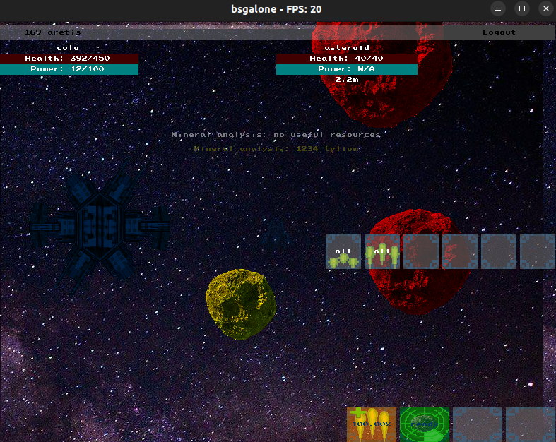
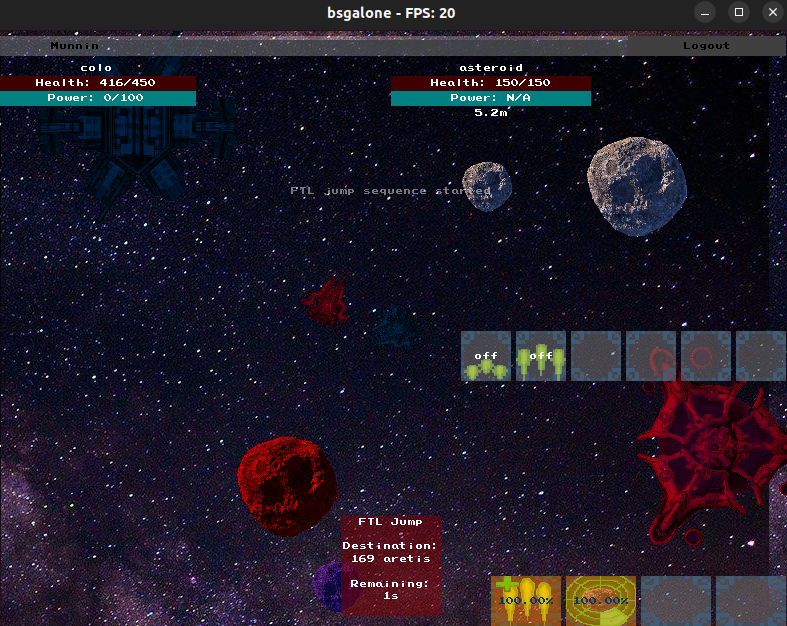
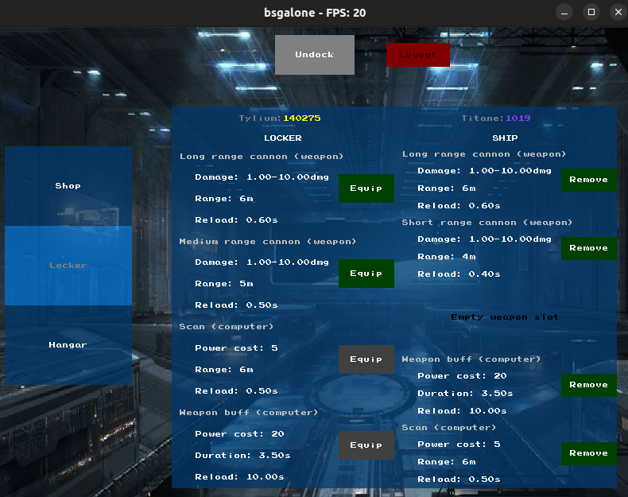
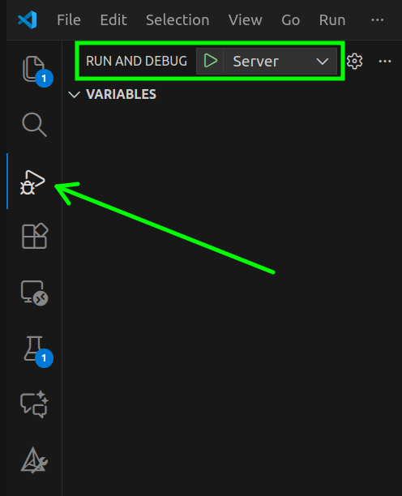

# bsgalone

This project aims at replicating the classic space shooter game [Battlestar Galactica Online](https://www.mmorpg.com/battlestar-galactica-online). It is not meant as a commercial project.

# What is the game about?

The goal is to have a 2d top view space shooter where the user can travel from systems to systems and fight enemies while mining resources and upgrading their ship.

Multiple players can connect to a ever-running server and compete or band together to play the game. Below are a few screenshots of the progress achieved during the development.

## Some visuals







## Why this project?

The goal of this project is to take inspiration from BSGO and copy some of the patterns used in it and also incorporate some original elements when they make sense.

It is also a very good opportunity to actually write a multi-player game which is something we never did before. There are many learnings that will come during the course of the development.

## What works?

As of the time of writing, the game offers:

- a persistent registration/log in system
- two factions which have similar capabilities but are able to fight each other in the game
- a persistent server to which clients can connect to
- a shop where the player can buy gear for their ships and equip them
- multiple systems where the players can travel
- some content in the systems in the form of outposts, asteroids and AIs
- a working health/power system to make fighting the other players/AIs slightly challenging
- a mining system where the player can accumulate resources to buy more gear for their ships
- clear separation of concerns where the client applications do not access the DB
- dynamic evolution of systems with periodic respawns of dead entities

## Limitations

Some known limitations:

- 2D game
- no collisions
- limited content in the systems
- various edge cases where the server will crash

# Badges

[](https://github.com/Knoblauchpilze/bsgalone/actions/workflows/build-ci-docker-image.yml)

[](https://github.com/Knoblauchpilze/bsgalone/actions/workflows/database-migration-tests.yml)

[](https://github.com/Knoblauchpilze/bsgalone/actions/workflows/build-and-push.yml)

[](https://codecov.io/gh/Knoblauchpilze/bsgalone)

# Installation

⚠️ The following sections are tailored for an installation on Ubuntu: this is what was used during the development. If you want to try to install it on another OS it probably works but some of the command will need to be adapted.

If you do so, please consider contributing the guide as an issue to help fellow developers!

## Prerequisites

This projects uses (among other things):

- [cmake](https://cmake.org/) as a build management system
- [ccache](https://ccache.dev/) as a wrapper to speed up the building process
- [asio](https://think-async.com/Asio/) as a networking library
- [postgresql](https://www.postgresql.org/) to create a database server
- [libpqxx](https://github.com/jtv/libpqxx) to establish database connections in the applications
- [golang migrate](https://github.com/golang-migrate/migrate/blob/master/cmd/migrate/README.md), to handle database migrations: following the instructions there should be enough
- a cpp compiler, typically [gcc](https://gcc.gnu.org/) to build the project
- [eigen](https://eigen.tuxfamily.org/index.php?title=Main_Page) for matrix manipulation
- [google test](https://github.com/google/googletest) as a testing library
- graphical libraries such as `X11`, `GL` and `PNG` for rendering
- [rsync](https://linux.die.net/man/1/rsync) for file management
- [urlencode](https://manpages.ubuntu.com/manpages/jammy/man1/urlencode.1.html) to handle escaping characters in passwords

## TL; DR

For a quick setup, just run the following commands to install all needed dependencies:

```bash
apt update

# Skip this if you already have the basics installed
apt install -y --no-install-recommends \
  cmake \
  build-essential \
  ccache

# To not request information when installing libgl-dev
export DEBIAN_FRONTEND="interactive"

# Those are the dependencies to compile the client and server applications
apt-get install -y --no-install-recommends \
  libasio-dev \
  libpqxx-dev \
  libeigen3-dev \
  libgtest-dev \
  libgmock-dev \
  libx11-dev \
  libgl-dev \
  libpng-dev \
  rsync \
  gridsite-clients

# Install migration tool, consider replacing the os and version
curl -L https://github.com/golang-migrate/migrate/releases/download/v4.18.3/migrate.linux-386.tar.gz | tar xvz
sudo cp migrate /usr/local/bin
```

**Note:** in case you're facing problem with installing one library or with compiling (see [section](#running-the-game-locally)), please refer to the following sections for library specific instructions. In case you face a unique problem, don't hesitate to open an [issue](https://github.com/Knoblauchpilze/bsgalone/issues).

**Note:** this project uses `-fprofile-update=atomic` as a profiling option to handle concurrency during profiling. This requires ccache [4.10.0](https://ccache.dev/releasenotes.html#_ccache_4_10) at least. In case your system comes with an older version it means that you won't benefit from having `ccache`.

**Note:** this project uses cpp20 and relies on features such as concepts. This should be supported by gcc10 (see [source](https://gcc.gnu.org/projects/cxx-status.html)). The development was made using gcc13. In case your version of gcc is older than this, refer to [this guide](https://www.dedicatedcore.com/blog/install-gcc-compiler-ubuntu/) to get an idea on how to install a more recent version.

## Clone the repository

The first step (as is often the case) if you want to work on this project is to clone the repository with:

```bash
git clone git@github.com:Knoblauchpilze/bsgalone.git
# Move to the project's folder
cd bsgalone
```

## libpqxx

This library is available in the package manager for Ubuntu. That being said, it is a bit tricky to get it working. It boils down to an important fix in [7.9.0](https://github.com/jtv/libpqxx/releases/tag/7.9.0) which allows the library to be used also with projects that don't use the same cpp version (see also issue [#732](https://github.com/jtv/libpqxx/issues/732)).

Notably, this project uses c++20 which can cause problem. In case you're unlucky and the version shipped with your package manager does not work, you can try to compile the library from source.

Additionally, the CI uses the `ubuntu:24.04` runner image which ships with [CMake 3.31.6](https://github.com/actions/runner-images/blob/main/images/ubuntu/Ubuntu2404-Readme.md#tools): this generates some error with version `7.9.1` (see issue [#851](https://github.com/jtv/libpqxx/issues/851)). Therefore we bumped all the way to `7.10.1` (the most recent at the time of writing).

The first step is to install `libpq`: it's automatically installed as part of `libpqxx` but not if you compile the library from source. You can run:

```bash
sudo apt install -y libpq-dev
```

**Note:** this is already handled in the CI runner and therefore we don't need to install it there.

Loosely based on what is described in the [README](https://github.com/jtv/libpqxx/blob/master/BUILDING-cmake.md#building-and-installing-libpqxx-yourself) and in the [cheat sheet](https://github.com/jtv/libpqxx/blob/master/BUILDING-cmake.md#cheat-sheet) for the build options, you can run the following commands:

```bash
cd /tmp
git clone https://github.com/jtv/libpqxx.git
cd libpqxx
git checkout 7.10.1
cmake \
  -DCMAKE_CXX_STANDARD=20 \
  -DCMAKE_BUILD_TYPE=Release \
  -DBUILD_SHARED_LIBS=1 \
  .
cmake --build . -j 8
sudo cmake --install .
```

This should have installed the version `7.10.1` of `libpqxx` under `/user/local/include/pqxx`.

## asio

This project uses the `asio` library for networking. There are two ways to install it: either using the version available in the packages. At the time of writing with Ubuntu 20.04 the packaged version is `1.18.1` which is quite old (2020). If you choose to do so, you can run:

```bash
apt-get install libasio-dev
```

You can also download the sources directly from the [official website](https://think-async.com/Asio/) (click on `Downloads`). This gives version `1.30.2` (at the time of writing).

**Note:** we used version `1.28` for the development.

The download process gives a `tar.bz2` file which can be extracted with (change the version as needed) and installed:

```bash
tar -xvjf asio-1.28.0.tar.bz2
sudo mkdir /usr/local/include/asio
sudo cp -r asio-1.28.0/include/* /usr/local/include/asio
```

You can remove the `Makefile.am` and `Makefile.in` files from this directory to not pollute the includes.

## postgresql

To install postgresql we can simply rely on the packages and run the following:

```bash
sudo apt-get install postgresql-14
```

The version may vary. `14` is the one we used for development but it should not be an issue to pick another one.

## PixelGameEngine

The application is built around the [PixelGameEngine](https://github.com/OneLoneCoder/olcPixelGameEngine). We found it is a reliable engine to create 2D applications and display some graphics. However, there are a couple of compilation problems when we add the typical options we use (such as `-Wall` and `-Werror`) due to the `#ifdef` directives to support multiple platforms.

We isolated the `PixelGameEngine` into its own library in [src/pge](src/pge) and abstracted the use of the graphic resources and rendering elements into it. This is not 100% enough as we still get some errors when compiling the library. We allowed unknown pragmas and fixed the unused parameters manually in [fa73574](https://github.com/Knoblauchpilze/bsgalone/commit/fa73574d0cd47cea663305058f257abad7e1ce7e).

Additionally the application does not define a very nice icon nor tooltip. This was changed directly in the [PixelGameEngine](src/pge/olc/olcPixelGameEngine.h) file in [28590d1](https://github.com/Knoblauchpilze/bsgalone/commit/28590d182a35e3977f3221c7991a6be6b2169241).

In case of a future update we can port those changes or adapt them.

Additionally, the engine requires a couple of graphic libraries to be installed on the system to properly function. Those are:

- `x11` (Ubuntu package: `libx11-dev`)
- `GL` (Ubuntu package: `libgl-dev`)
- `png` (Ubuntu package: `libpng-dev`)

They should be available in most package managers.

## VScode configurations

### Extensions

In order to make it easy to debug and work on the project directly into the IDE, the following two extensions are recommended:

- [cmake-tools](https://marketplace.visualstudio.com/items?itemName=ms-vscode.cmake-tools)
- [test-mate](https://marketplace.visualstudio.com/items?itemName=matepek.vscode-catch2-test-adapter)

They will respectively help you build the project and debug/start it in your IDE and allow to run and debug tests.

The following sections assume that you installed both.

### Configuration for intellisense

In case you use VScode as an IDE to work on this project, it is recommended to create a `.vscode` folder at the root of the directory. You can then copy past the following configuration in a `c_cpp_properties.json` file:

```json
{
  "configurations": [
    {
      "name": "Linux",
      "includePath": [
        "${workspaceFolder}",
        "/usr/local/include",
        "/usr/include"
      ],
      "defines": [],
      "compilerPath": "/usr/bin/g++",
      "cppStandard": "c++20",
      "intelliSenseMode": "linux-gcc-x64",
      "configurationProvider": "ms-vscode.cmake-tools"
    }
  ],
  "version": 4
}
```

Note that this will require you to have a local `g++` version supporting at least `c++20`. You can find more information about the syntax for this file in the [documentation](https://code.visualstudio.com/docs/cpp/customize-cpp-settings#_browse-properties).

### Configuration for CMake

The `cmake` tool extension allows to configure a custom build folder and to set arguments for the configure step. In this project we use conditional targets to build the tests: this is activated (as defined in the [Makefile](Makefile)) by the `ENABLE_TESTS` flag.

It is required to instruct the extension to use this flag when configuring the project so that it detects correctly all the target.

You can use the following configuration and paste it in the `.vscode` folder created above under `settings.json`:

```json
{
  "cmake.configureOnOpen": false,
  "cmake.buildDirectory": "${workspaceFolder}/cmake-build/Debug",
  "cmake.configureArgs": ["-DENABLE_TESTS=ON"],
  "testMate.cpp.discovery.gracePeriodForMissing": 500,
  "testMate.cpp.discovery.runtimeLimit": 500,
  "testMate.cpp.test.advancedExecutables": [
    {
      "pattern": "cmake-build/**/*{test,Test,TEST}*"
    }
  ],
  "C_Cpp.errorSquiggles": "enabled",
  "C_Cpp.default.compilerPath": "/usr/bin/g++"
}
```

### Launch/debug configuration

In order to run and debug the executables created by the project you can use the following launch configurations: the two configurations will allow to launch either the server or the client application and allow to debug them directly in the IDE if needed. You can paste the following content in a file under `.vscode/launch.json`:

```json
{
  "version": "0.2.0",
  "configurations": [
    {
      "name": "Server",
      "type": "cppdbg",
      "request": "launch",
      "program": "${workspaceFolder}/cmake-build/Debug/bin/bsgalone_server",
      "args": [],
      "stopAtEntry": false,
      "cwd": "${workspaceFolder}",
      "environment": [
        {
          "name": "PORT",
          "value": "2323"
        }
      ],
      "externalConsole": false,
      "MIMode": "gdb",
      "setupCommands": [
        {
          "description": "Enable pretty-printing for gdb",
          "text": "-enable-pretty-printing",
          "ignoreFailures": true
        },
        {
          "description": "Set Disassembly Flavor to Intel",
          "text": "-gdb-set disassembly-flavor intel",
          "ignoreFailures": true
        }
      ]
    },
    {
      "name": "Client",
      "type": "cppdbg",
      "request": "launch",
      "program": "${workspaceFolder}/cmake-build/Debug/bin/bsgalone_client",
      "args": [],
      "stopAtEntry": false,
      "cwd": "${workspaceFolder}",
      "environment": [
        {
          "name": "PORT",
          "value": "2323"
        }
      ],
      "externalConsole": false,
      "MIMode": "gdb",
      "setupCommands": [
        {
          "description": "Enable pretty-printing for gdb",
          "text": "-enable-pretty-printing",
          "ignoreFailures": true
        },
        {
          "description": "Set Disassembly Flavor to Intel",
          "text": "-gdb-set disassembly-flavor intel",
          "ignoreFailures": true
        }
      ]
    }
  ]
}
```

This should allow you to pick the `Server` configuration win the `RUN AND DEBUG` tab:



# Setting up the DB

## Generalities

The game uses data saved in a database to define elements of the gameplay. In order to do this we rely on a database being created and populated with data. The database is then accessed both by the client and the server through the same user.

## How to send commands to the postgres server

In order to create the database and then perform the migration, we need to use at least once the default `postgres` user to create a new one. This new user will then be used to perform all the rest.

On first inspection it seems like to do that we need to authenticate with the `postgres` user. The first thing which was not working as easily as we thought is that running the default `psql` command is trying to connect using Unix sockets which are apparently configured to use peer authentication. This can be checked in the file `/etc/postgresql/14/main/pg_hba.conf`:

```
local   all             postgres                                peer
```

According to this [Stack Overflow post](https://stackoverflow.com/questions/66915087/postgresql-psql-error-fatal-peer-authentication-failed-for-user-userrole) a way to change this behavior is either to change the `peer` value to something else or to use TCP for example by adding `-h 127.0.0.1` or `-h localhost` as an option of the command line.

## Altering the postgres password

The second problem that arised was that once we were able to communicate with TCP, we were prompted the `postgres` user password. This is not known to us. This [Stack Overflow post](https://stackoverflow.com/questions/27107557/what-is-the-default-password-for-postgres) provided useful guidance to change it to something we know.

## Creating the database

Once all of the above is done, we can successfully run the provided scripts to create a user (see [create_user.sh](database/create_user.sh)) first and then use this user to create the database with [create_database.sh](database/create_database.sh).

Both scripts expect a path to be given as argument: this should be the path to the folder containing the migrations and scripts. In this repository it is in [database/bsgo](database/bsgo).

Additionally, creating the users for the database follows a similar procedure are described in the [galactic-sovereign](https://github.com/Knoblauchpilze/galactic-sovereign?tab=readme-ov-file#creating-the-database) project.

In summary, you can prepare the database for the game with the following commands:

```bash
cd database
export ADMIN_PASSWORD=admin_password
export MANAGER_PASSWORD=manager_password
export USER_PASSWORD=user_password
./create_user.sh bsgo
./create_database.sh bsgo
```

There's also a convenience script provided in [scripts/setup_database.sh](scripts/setup_database.sh) which will run all the commands for you. Just run:

```bash
./scripts/setup_database.sh
```

## Populating the database

We use `migrate` to manage the database and perform the data migrations. Once the previous step is complete (so the user and the database both exist) one can simply go to the [migrations](database/migrations) folder and run:

```bash
make migrate
```

**On a fresh database**, this will trigger all the migrations in order. If the database is in an intermediate state then it will only run the missing migrations.

## Managing the database

Once the database is created, it is easy to add migration files in the folder and run again `make migrate` to apply them. If one of them needs to be reverted, `make demigrateO` can be used to undo the last migration while `make demigrate` will undo all the migrations and basically restore the database to its initial (empty) state.

## Drop the database

In case it is required to drop the database completely, a convenience script is available under [drop_database.sh](database/drop_database.sh). It is possible to recreate the database again by following the same procedure starting from the top [section](#creating-the-database).

You can additionally use [drop_user.sh](database/drop_user.sh) to drop all three users created by the service. This is usually not necessary.

## Creating migrations and generating uuids

According to this [Stack Overflow](https://stackoverflow.com/questions/72144228/sequelize-migration-throws-error-function-uuid-generate-v4-does-not-exist) question it seems like we can directly use `gen_random_uuid` with versions of postgres more recent than 14. This is our case.

Another approach as we need to deserialize the data from the database is to use plain integers for identifiers. This is probably enough for now. To this end it seems like the way to go about it is to use `generated always as identity` (taken from this [Stack Overflow](https://stackoverflow.com/questions/55300370/postgresql-serial-vs-identity) post).

## Allowing clients to connect to the database

As of now each client will connect to the database and try to get information from it. This is mainly the case when processing messages and initializing the UI.

By default postgres does not allow incoming connections from remote host to come through. In order to allow the host machine to accept those we need to modify the configuration of the postgres a bit.

Once again we found a nice [Stack Overflow](https://stackoverflow.com/questions/17838613/open-port-in-ubuntu) post explaining what needs to be done. The steps are presented in the following sections.

### Edit: postgresql.conf

Edit the file:

```bash
sudo nano /etc/postgresql/<version>/main/postgresql.conf
```

And enable or add:

```
listen_addresses = '*'
```

### Edit pg_hba.conf

Edit the file:

```bash
sudo nano /etc/postgresql/<version>/main/pg_hba.conf
```

Register the network mask you want to allow connections from. A `0` stands for a wildcard and we chose to restrict to local network for now by adding the following:

```
host    all             all             192.168.1.0/0          scram-sha-256
```

The connection method was changed from `md5` to `scram-sha-256` as recommended by this [DBA stackexchange](https://dba.stackexchange.com/questions/83984/connect-to-postgresql-server-fatal-no-pg-hba-conf-entry-for-host) post: it is supposed to be more secured than the old `md5` approach.

With this we were able to connect from a remote computer to the database hosted on another machine.

# Running the game locally

When all the steps above have been successfully completed you can simply start the game locally. You will need two different terminals. The [Makefile](Makefile) defines useful commands to ease the process:

```bash
# in one terminal
make runserver

# in a second terminal
make runclient
```

If everything goes well you should see some logs appearing in both terminals and a window looking like the one below appear:


# Client/Server architecture

## Generalities

The aim of the project is to provide a client server architecture where multiple players can connect to the game and play together. In order to achieve this we decided to go for an authoritative server and separate client.

From the code perspective there are elements and structures that will be used both by the client and the server.

It is not so clear cut whether writing the server and the client in the same language bring huge benefits. This [article](https://softwareengineering.stackexchange.com/questions/171343/how-important-is-using-the-same-language-for-client-and-server) summarizes the research we did on this topic. As a summary: it depends™.

## Discussion on our approach

For now the client is written in C++ thanks to the `PixelGameEngine` renderer. We also developed the rest of the game (the ECS and the interaction with the database) in C++ for this reason.

As we only started to have a look at the server a bit later on, we had a choice to make between continuing the implementation of the server also in C++ or using a different language.

Our initial idea was to use `Go` as the server's language: we are more familiar with it and it handles the threading and networking quite well.

However the problem with it would be that we would have to essentially make some wrappers around the core game classes (the ECS system) as we don't want to rewrite it. Also the network part would probably involve some conversions between the data structure we receive in Go and the binding to communicate to the server in C++. This is a similar situation we faced in the past for other projects and it was usually a bit of a pain to handle. Moreover, the networking shouldn't be such an issue that we would consider writing the server in another language: as we anyway will have to handle some level of networking on the client, it seems a bit counterproductive to do it a second time in the server.

## Structure of this repository

We divided the [source](src) folder into several directories to make it easy to segregate code that belongs to one application from the rest.

When adding new features it is important to think about whether they would benefit only to the client or to the server or both. This most of the times provides a strong hint as to where they should live.

It can also be that later on we realize that the `bsgo` library is too big, or that some separate features (for example Data Transfer Objects) can be shared: this could be achieved by adding more top level folders in the [src](src) directory.

### core

The [core](src/core) folder contains some utilities that are used throughout the project. The code is inspired from parts from the [core_utils](https://github.com/Knoblauchpilze/core_utils) repository. Instead of having it as an external dependency it was simpler to copy parts of it and just have them locally.

Based on future developments we might decide to externalzie this or to use a submodule instead.

### bsgo

The [bsgo](src/bsgo) folder contains the core game library defining the Entity Component System and the interaction with the database. This is used both in the server and the client application.

### net

The [net](src/net) folder contains the networking elements used to make the server and the client communicate with one another. This code is used in both applications and uses the `asio` library.

Currently even though none of the internal of `asio` are exposed in the interface of the library, we still require the library headers to be installed on the system. This could be changed in the future.

For an implementation overview of the network library please refer to the dedicated section over at [networking](#networking).

### pge

The [pge](src/pge) folder contains the code to interact with the `PixelGameEngine`. It is used in the client to handle the rendering of the graphic interface.

By having it in a dedicated folder, we are able to minimize the surface we would have to replace if we want to use a different engine. This also allows to easily update it without having to change too much code: the rest of the modules (mainly the client) do not know that the underlying drawing routines are using the `PixelGameEngine`.

### server

The [server](src/server) folder defines all the server specific code. It defines all the structures needed to accept client connections and handle the persistent simulation of the game loop.

### client

The [client](src/client) folder regroups all the code that is used exclusively by the client. It links against the core library and enriches it to present a compelling application to the player. It also serves the purpose of connecting to the server and updating the local data with what the server transmits.

## Communication between client/server

In a client/server architecture it is necessary to define ways for both applications to communicate with each other through the network. Some changes are just relevant for one client, some are relevant for all players registered in a given system and some elements are relevant for every connected players.

Typically the clients will try to perform some actions which have an impact on the game. In an authoritative server we have to somehow validate these changes before they can be applied.

### Transmitting data

Throughout the project we rely on messages. Messages are atomic piece of information that can be interpreted by the server and the client alike. The typical scheme is that the client will send messages to the server and get in return and in an async way one or several messages responding to the initial request.

The server on the other hand will produce messages on its own (based on what happens in the game loop for example) but also after it validated requests from the clients. Each message will then be sent to connections which might be interested in the change.

For more details on how the messaging system works, please refer to the dedicated section in the [implementation details](#messaging-system).

Below are presented a few base types for the communication.

#### NetworkMessage

A [NetworkMessage](src/bsgo/messages/NetworkMessage.hh) is a message associated to a client. A client is a unique identifier assigned by the server to a client application. This helps determining who sent a message and sending the response back to the right clients.

These messages are typically sent by the client applications as they know which client identifier they received from the server. The server is usually either propagating the input client id or erasing it in case the response to a message might be interesting for more than one client.

### Communication protocol

When the server is started, it will start listening to incoming connections. When one is received, the first thing that the server does is to assign it a client identifier (this is done by the `net` subdomain) to be able to publish events for this client. This identifier is **not sent to the client**: this is because the client does not need to know it as any communication will happen through the connection which the server can associate to the identifier it holds.

To start the game the client application will present the user with a login/sign up screen: in both cases the idea is to make the client select a username and password and try to log into the game. This will result in a message sent from the client to the server (either [LoginMessage](src/bsgo/messages/LoginMessage.hh) or [SignupMessage](src/bsgo/messages/SignupMessage.hh)) and which can be validated by the server.

On top of the validation the server will also associate the connection (and the client id) with the player id and its current system. This will help determine when a message produced by the server should be transmitted to this client. For example if an entity dies in a system (be it a player or an AI), we need to transmit this information to all clients currently playing in this system. To achieve this, the server has to loop through all the active connections and pick the ones that are associated with a player in the relevant system.

We provided a mechanism for a player to log out: in this case we send a [LogoutMessage](src/bsgo/messages/LogoutMessage.hh) which will indicate to the server that the corresponding client's connection is no longer associated with the player's id and system: this will help making sure that we stop sending updates for the system to this connection.

In case the connection is lost without graceful termination, we automatically detect this in the server and simulate a logout process by sending a `LogoutMessage` before terminating the connection. This allows to make sure that the player's ship is still sent back to the outpost and that other clients are made aware of the disconnection.

### Who's right?

There's an asymmetry between how the server and the client applications process the messages. Regularly, the server will send updates to the clients about the current state of the entities. These updates are synchonization point for the clients which can then control their internal representation of the game and update it based on what the server reports.

In such cases, the client will just takes what the server says at face value and make the necessary changes to be up-to-date with what the server indicates. This is not the case for the server: the server always questions what the client applications are sending before making any changes.

Now even if the client should ultimately conform to what the server says, there are nice ways to do it so that it does not degrade too much the game experience of the players. There are a couple of nice resources that we found, the best of which being this article on Gabriel Gambetta's [website](https://www.gabrielgambetta.com/client-server-game-architecture.html). We did not implement any of this until now.

# Server design

## General idea

Ideally the server should process the events generated by the clients and return an answer to them, in the forms of one or multiple messages. If we designed the data structures right, we should be able to essentially instantiate the same game loop as for the clients and plug in the messages coming from the network into the internal game loop. Those messages will be picked up by the ECS and generate some more messages. In turn, the output messages should be broadcast to the clients that are interested in them.

## System processing

In the context of this game, the server has to simulate multiple systems which are very similar: there are a bunch of ships (AIs and players) in them, and they can interact with one another.

By its nature, each system is independent: no action taken in one system can have impact on another system. This seems like a very nice simplification as it essentially means that we can easily parallelize and decouple the simulation of each system.

In order to achieve this, we created a [SystemProcessor](src/server/lib/game/SystemProcessor.hh) class: its role is to regroup all the structures needed to fully simulate what happens in a system and to make it run in its own thread.

This class contains:

- a [Coordinator](src/bsgo/Coordinator.hh) responsible to list all the entities for this system
- some [services](src/server/lib/game/services/Services.hh) responsible to process the messages generated by the clients and the internal ECS in this system
- some [processes](src/server/lib/game/processes/Processes.hh) responsible to update some aspects of the game outside of the ECS (e.g. spawning entities, etc.)
- an [EntityMapper](src/bsgo/data/DatabaseEntityMapper.hh) responsible to keep track of a mapping between the database and the entities

This processor runs asynchronously in its own thread and handles the simulation in the following steps:

- updating the entities
- running the processes attached to the system
- processing the messages related to this system

The output of this simulation is a bunch of messages that need to be dispatched to the various clients interested in them.

The messages are processed through a [consumer](#a-note-on-consumers) mechanism: please refer to the following section to learn more.

## A note on consumers

Messages are usually meant to be processed by some objects responsible to validate them and knowing what effects they might have. A popular approach to handle it is to use a [Publish-Subscribe](https://en.wikipedia.org/wiki/Publish%E2%80%93subscribe_pattern) pattern: for each type of message, we have a corresponding consumer which deals with them and handle their consequences. They are registered in the [consumers](src/server/lib/consumers) folder, segregated in their 'kind'.

Each consumer registers itself to a message queue and indicates its interest in receiving a specific type of messages (or several). When one is received, we can intercept the message and perform the necessary verification before processing it.

In the case of a [DockMessage](src/bsgo/messages/DockMessage.hh) for example we can check that the ship concerned by the message is not already docked and that it is close enough to the outpost and that it does not try to dock to an outpost in a different system etc.

The consumers are usually using a dedicated service to process a message after doing some simple verification related to the messaging framework (for example that all fields are correctly populated). The services are where the business logic lives.

To come back to the dock example, the [DockMessageConsumer](src/server/lib/consumers/system/DockMessageConsumer.hh) relies on the [ShipService](src/bsgo/services/ShipService.hh) to perform the docking.

This approach is quite flexible as it allows to easily keep messages which would fail to be processed for later analysis and make it easy to separate messages and make them processed by the most relevant consumers.

Consumers are separated in the server based on their kind:

- [input](src/server/lib/consumers/input) consumers are responsible to handle user operation such as login or signup: anything that is not part of the game loop
- [system](src/server/lib/consumers/system) consumers are responsible to handle messages specific to a system. We typically have multiple instances of each consumer in the server, one per system
- [internal](src/server/lib/consumers/internal) consumers are responsible to handle messages that are generated by the server and need additional processing before being sent out to client applications. A typical example is a jump message: when a client jumps from one system to another we need to handle some changes in the source and the destination system which is handled through an internal message

## Triaging messages

The server is responsible to handle a lot of messages from various sources. This includes:

- messages incoming from various client connections
- messages produced by the `SystemProcessor`s
- messages produced internally and needing to be processed before being sent to clients

After several iterations the following design was chosen:


The main entry point of the server is the `InputMessageQueue`: this sends messages to a triage consumer whose only responsibility is to route messages to a consumer that can process them.

We have some interconnection between the system message consumers and the system processors: some messages will lead to changes in the systems such as logging out of the game where we need to remove the player ship's entity from its system.

We also allow system processors to send internal messages which need to be processed before they can either be sent to the clients or rerouted to be processed by a different system.

Finally the [BroadcastMessageListener](src/bsgalone/server/lib/messages/BroadcastMessageListener.hh) is responsible to route the messages produced by the server to the right clients: this can be done by directly checking the client id if available or by checking in which system the messages belong to and broadcasting them to all connected clients.

# Entity Component System

## Generalities

In order to represent the various elements of the game and their properties, we decided to implement an [entity component system](https://en.wikipedia.org/wiki/Entity_component_system).

The goal of this mechanism is to avoid the deeply nested class hierarchy common when developing a game. We already tried this approach when dealing with the agents (see the [agents](https://github.com/KnoblauchPilze/agents) repository).

While researching how to implement it we found this blog [codingwiththomas](https://www.codingwiththomas.com/blog/an-entity-component-system-from-scratch) which presents the implementation of such a system from scratch. It is well documented and explains the concept in quite some details.

In comparison with the `agents` project we decide to follow the paradigm a bit better and actually created some systems and a way to iterate through the entities.

### Entity

The [Entity](src/bsgo/entities/Entity.hh) is the base class and is basically just an identifier with a list of components. We added some convenience methods to assess the existence of some component and access them in a secure way.

### Component

A [Component](src/bsgo/components/IComponent.hh) is the base class for all components. It just defines one basic method to update the component with some elapsed time. This might or might not be useful to the inheriting components but allows to have some quantity varying over time.

The goal of the implementation is to keep away the processing from the components in favour of putting it in the systems.

### System

A [System](src/bsgo/systems/ISystem.hh) is iterating over the entities and only processing the ones that are interesting. Our implementation defines an `AbstractSystem` which aims at iterating over the entities.

The constructor expects the inheriting classes to pass a callback which will be used to filter the entities and keep only the ones that are interesting for the system. This typically involves checking if an entity has some components which are handled by the system.

Typically if an entity defines a [HealthComponent](src/bsgo/components/HealthComponent.hh) we expect it to be processed by the [HealthSystem](src/bsgo/systems/HealthSystem.hh).

### Process

A [Process](src/server/lib/game/processes/IProcess.hh) is a server specific component. While it does not belong to the ECS, it works closely around it by applying some updates and handling transient processes which happen not on a specific entity but on the ECS as a whole.

Typical example include respawning dead entities or synchronizing the entities with the database. In the future this could also be aggregating activity in a system, generating recommendations for players to go in a system based on the fighting happening there, etc.

Compared to a system, those processes do not typically iterate over the entities but rather use some external mechanism to determine which entity might need to be scanned, created or deleted.

It is also a server only logic because this mostly correspond to game processes that the players don't have control over.

### Coordination

In order to keep together all properties of the ECS, we created (as advised in the initial link we got inspired from) a [Coordinator](src/bsgo/controller/Coordinator.hh) class which is responsible to keep all the entities and their components along with systems.

This class has a convenient `update` method which can be called to process all the systems in a consistent order and make the simulation advance one 'step' ahead in time.

For the server case, the `Coordinator` is also attached a list of processes which are executed alongside the main loop to change the ECS in various ways.

## How to interact with the ECS?

### Why is it difficult?

In its simplest form, an ECS is initialized when creating it and then updated regularly to make changes to the entities within it. This is done through the `Coordinator` and works pretty well.

However, when the user is playing, there are some interactions which will influence how the entities evolve: for example if the user tries to move its ship, or attacks another one, we need to make some modifications to some components of some entities.

Similarly, there are cases where the ECS, through its processing, will change the state of one of the component. For example when the countdown to jump to another reaches 0, the [StatusComponent](src/bsgo/components/StatusComponent.hh) will need to notify the outside worl that there's some action required to move the entity it belongs to to another system.

### Research

A straightforward solution is to make the UI aware of the ECS and just let them update whatever data they assume is meaningful to it. This has the benefit that it is simple to implement. This however does not work at all for a distributed system. We could find a bunch of relevant links on how to deal with this.

In [How to sync entities in an ecs game](https://gamedev.stackexchange.com/questions/178469/how-to-sync-entities-in-an-ecs-game) and [Networking with entity component system](https://www.reddit.com/r/gamedev/comments/5oib5v/networking_with_entity_component_system/) the recommendation is to use a `NetworkComponent` or something similar. The idea in each case is to have some dedicated `NetworkSystem` which takes care of receiving data and updated the entities which have a network component. The network component can presumably be either very stupid (just flagging the entity as having some form of networking aspect) or a bit smarter and define for example the properties of other components needing to be synced.

The topic in [How to network this entity system](https://gamedev.stackexchange.com/questions/21032/how-to-network-this-entity-system) does not recommend to go for a 'smart' network component as this is essentially mirroring what already exists in other components. Instead it seems like the approach would then be to have the `NetworkSystem` be able to deal with each component in a way similar to:

- check if the entity has a network aspect
- if yes iterates over all registered component
- for each component call an internal method that indicates which properties need to be updated and how

One drawback of this is that the `NetworkSystem` will grow quite a bit due to handling all the components we have in the game. The plus is that there's a single place which should deal with network communication. We could possibly also include the various reconciliation mechanisms here.

Finally the [Documentation of Space Station 14](https://docs.spacestation14.com/en/robust-toolbox/ecs.html) indicates some sort of `dirty` property to attach to component which would make the job of the `NetworkSystem` easier: by checking this we know if it should send data to the network or not. This is quite interesting as it allows to not keep track internally in the system of the previous states of all components to detect modifications.

In the end we dediced to go with a mixture of both suggestions: we have a `NetworkComponent` but it ultimately sends messages representing the changes to an entity's components.

## Bring information into the ECS

The processing to bring information into the ECS is similar whether we're in the client or server application: the idea is that some external process needs to update the components of an entity.

This is done by using the [IService](src/bsgo/services/IService.hh) mechanism: we consider this layer as the business logic of our project and its goal is to get the entity from the `Coordinator` and then update manually its component to their desired value.

A limitation of this is that as we don't have concurrency protection mechanism the processing has to be synchronous with the processing of entities: this is ensured by the `SystemProcessor` which processes first the messages (which in turn calls the consumers and then the services) and after this the `Coordinator::update` method.

## Notify information outside of the ECS

In the case of the jump example we have to somehow bring the information that the jump should happen outside of the ECS.

At first glance it seems like the best place to try to act on this would be to have a hook in the `System`s: we know that they are responsible to make the components of each entity evolve and so any change that should trigger a notification will be detected at this point.

To solve this problem we made the `System`s aware of a message queue: they can push messages to the queue if needed indicating what happened. These messages can't really have a client id or anything that attaches them to a client because they are generated internally by the ECS: we don't even know if there's any player attached to an entity.

It seems then clear that these messages will need some additional processing before being sent to client applications. This is the purpose of the internal message queue with its consumers so we need to make the `System`s aware of the internal message queue.

A final note is that this system is quite flexible: as the `System`s are called regularly for an update, it is quite easy to also have periodic updates sent to the queue so that client applications get a continuous stream of updates from the server and can be reasonably confident that they're in sync with the server. See the following [section](#a-note-on-networkcomponent) for more details.

## A note on NetworkComponent

Some changes in the ECS are one-off (e.g. a jump, an entity dying) and others which we want to trigger on a more regular schedule.

One general principle is that as the client applications are running essentially the same simulation as the server, we want to keep them in sync as much as possible. This usually means publishing regular updates of some aspects of the ECS to the clients.

Going a step further, we even have systems that are not present on the client applications such as the health system of the removal system: this is because such processes need to be validated by the server before any action is taken on the client's side.

In order to solve this problem we created a [NetworkComponent](src/bsgo/components/NetworkComponent.hh): it defines a list of properties that need to be 'synced' and acts in the following way (with its companion [NetworkSystem](src/bsgo/systems/NetworkSystem.hh)):

- each component defines an update interval
- the network system detects when a component has not been synced since long enough
- in this case it sends an update message with all the properties needing to be synced

We rely on the rest of the server to route these update messages to the clients that are interested in them (so the clients which are in the same system as the entity).

## How does it work with the database?

An important thing to note is that the ECS never interacts directly with the database: it's only way to communicate with the outside world is either through direct synchronous modification of its internal state (which is not under its control) or by pushing some messages to a queue to notify of a change.

# Client design

## Generalities

The goal of the client's application is to provide a view of what's happening in the server for a specific player. On top of aiming at replicating what is happening on the server, it should also allow the player to transmit commands to the server so that a specific entity is following what the player wants.

The application has two main problems to solve:

- how to send updates to the server from the UI?
- how to apply the updates from the server to the local UI and ECS?

## Splitting the tasks in the UI

The client application splits the responsibilities to react to the user's input into several facets:

- the [IRenderer](src/client/lib/renderers/IRenderer.hh) takes care of rendering the visual elements
- the [IUIHandler](src/client/lib/ui/IUiHandler.hh) takes care of rendering the UI
- the [IInputHandler](src/client/lib/inputs/IInputHandler.hh) takes care of interpreting the input of the user

In addition the client also defines the notion of a [Screen](src/client/lib/game/Screen.hh): this is a way to represent which is the active view currently displayed in the application. Typically the panel of actions available to the user will not be the same whether they are in the outpost or not logged in or playing the game.

Typically each screen will have a specific renderer, a UI handler and an input handler. Some screens might only get some of these elements.

## Sending information to the server

As described in the [communication protocol](#communication-protocol), the client and the server have a set of predefined message allowing to start and close the communication channel between both.

When the client has successfully logged in to the server, the user will click on items in the UI and generally performed actions that should have an impact on the simulation.

In order to send these commands to the server, we use the concept of a [IView](src/bsgo/views/IView.hh): a view is the equivalent of the business layer (so a [IService](src/bsgo/services/IService.hh)) but for the client: the idea is that each button of the UI (for example the dock button, or the button to purchase or equip an item) is binded to a method of a view. The view is then responsible to know which action should be triggered to accomplish this action.

Accomplishing an action usually means sending a message to the server. The message is sent once again through a message queue: the [GameNetworkClient](src/client/lib/network/GameNetworkClient.hh). This client is used for:

- connecting to the server
- receiving data
- sending data

We follow a _send and forget_ approach when pushing messages: the idea being that if the event is valid the server will react in some way and send back some messages the client's way which will trigger a visual feedback for the player. If it is invalid no answer will be received and the UI will not change after the action (e.g. a button click).

## Receiving information from the server

The actions that the user takes in the UI usually have a goal to change some state of the player's account: for example buying an item, moving the ship somewhere else, etc. Assuming the server successfully processed a message sent by the client, it will send back an answer. Additionally, some messages will be generated and transmitted to the client because of the actions of other players.

In order to process those incoming messages, the client receives them in a [NetworkAdapter](src/bsgalone/core/network/NetworkAdapter.hh) in a very similar way to the server.

We then follow the same approach as in the server: the client defines some [consumers](src/client/lib/consumers) which are responsible to handle the messages received from the server and update the local ECS. As described in the [who's right](#whos-right) section, the difference is that the client applies without check what the server sends.

A special consumer is the [GameMessageModule](src/client/lib/game/GameMessageModule.hh): its role is to interpret messages which are changing the state of the UI and react to them. This typically includes messages indicating that the player died, or that it changed system.

## Adapting the ECS

While the ECS in the server is responsible for the whole simulation, there are some aspects that the client does not need to simulate. To this end, the [Coordinator](src/bsgo/controller/Coordinator.hh) class (which is also used in the server) defines a way to deactivate some systems.

The client uses this in order to not instantiate systems dealing with events that need to be confirmed by the server. This includes for example the removal system: we don't want to remove an entity from the client's simulation unless the server says to do so: in this case the [RemovalSystem](src/bsgo/systems/RemovalSystem.hh) is deactivated in all client's applications.

# Implementation details

## Networking

### Generalities

The content of this [video series](https://youtu.be/2hNdkYInj4g?si=Q-NOTJ__p-5a2jS8) of Javidx9 was very informative. The resulting code can be found on [github](https://github.com/OneLoneCoder/Javidx9/tree/master/PixelGameEngine/BiggerProjects/Networking). This inspired the initial network design before being heavily rewritten to make it event driven (see [#81](https://github.com/Knoblauchpilze/bsgalone/pull/81)).

We use the [asio](#asio) library without boost to handle network communication in the project. We extracted all the logic to perform the calls, connect to the server and to the client in a dedicated [net](src/net) folder: similarly to what happens for the `PixelGameEngine` wrapping, we want to be able to swap libraries or update relatively easily.

This module is designed using the event driven approach. Instead of using callbacks or direct method calls, the network activity is represented by various events which can be received by external components. The available events are defined in the [EventType](src/net/enums/EventType.hh) enum class and covers connection/disconnection but also data operation (send or receive).

The general architecture is presented in the following diagram:


### Context

The networking revolves around the idea of an `io_context`. This is wrapped by our own [AsioContext](src/net/server/AsioContext.hh) class which is instantiated both on the client and the server. The idea is that this context runs from the whole lifetime of the application and is used in the background by `asio` to perform the network calls.

### Sockets

A socket is the central object allowing to communicate. No matter whether the socket is handled in the client or the server, there are two main operations that can be performed: read and write. To handle both processes, the `net` module defines both a [ReadingSocket](src/net/sockets/ReadingSocket.hh) and [WritingSocket](src/net/sockets/WritingSocket.hh).

### AsioServer

A specific component of the server is the [AsioServer](src/net/server/AsioServer.hh) class. This class wraps the low level socket management by:

- providing a simple interface to start/stop the server
- exposing only the relevant information to configure it (e.g. the port)
- allows dependency injection by accepting an `AsioContext` as input
- accepting connections and creating the sockets
- allows to be notified about network events through an event bus

Importantly, it does **not expose** the sockets: instead, it pulishes the changes through an event bus. For example a `ClientConnectedEvent` is produced when a connection is received, a `DataReadEvent` is produced when data is received on one connection.

### AsioClient

Similarly to what is done in the `AsioServer`, the [AsioClient](src/net/client/AsioClient.hh) class allows to publish network events in an externally provided event bus. This class abstracts the connection to the server by exposing:

- a simple connect/disconnect interface
- allows to provide the URL and port to connect to
- allows dependency injection by expecting an `AsioContext` and an event bus
- events to be notified about network activity (e.g. data received)

This component can be used to decouple the handling of the network logic from the game and the UI logic in the client applications.

### Additional abstractions

The low level `AsioServer` and `AsioClient` are used in higher order components: `TcpServer` and `TcpClient`. This second layer of abstraction allows to hide the logic related to `asio` completely. The only external need is the event bus which will be used to push the network related events. Those classes implement respectively the `INetworkServer` and `INetworkClient` interfaces: those interfaces allow to make the network library used an implementation detail of the module.

## AI of bots

While doing some research we found out that it seems there are two main ways to handle AI for NPCs: [behavior trees](#behavior-trees) and [state machines](#state-machines).

### Behavior trees

During the research we gathered the following collection of articles:

- one on [gamedeveloper](https://www.gamedeveloper.com/programming/behavior-trees-for-ai-how-they-work).
- one on the root website of the approach (as it seems :D) at [behaviortree.dev](https://www.behaviortree.dev/).
- and of course on [wikipedia](<https://en.wikipedia.org/wiki/Behavior_tree_(artificial_intelligence,_robotics_and_control)>).

### State machines

State machines seem pretty linked to Unity which probably has an implementation of them. The collection of articles below present the concept:

- one explaining how it works [in Unity](https://pavcreations.com/finite-state-machine-for-ai-enemy-controller-in-2d/2/#Activity-class).
- this one without Unity over at [tutsplus](https://code.tutsplus.com/finite-state-machines-theory-and-implementation--gamedev-11867t).
- this [one](https://www.gamedeveloper.com/programming/designing-a-simple-game-ai-using-finite-state-machines) is similar to the previous one but simpler.

### Decision

For our purposes it seems like both things could work:

- state machines might be easier if it's easy to come up with all the states beforehand: then it's clear what are the transitions and what can happen in any state.
- decision trees might require a more careful definition of what can happen in which scenario. The fallback mechanisms are also not as clear as with the state machine where it's just transitioning to another state: here we would have to go up the hierarchy and see what to do.

After pondering a bit, we decided to go for behavior tree. The state machine seems similar to how we already approached AI in the past so maybe it's a good idea to try something new.

### Current state of the AI

The idea behind the behavior tree is to have a list of nodes arranged in a graph. They are executed at each step which allows to easily react to new situations. Contraty to state machines, we don't have to think about switching from any state to any other state: at each frame we just start from the root again and see which state we end up with when the execution of the tree is finished.

Each node has an execution [state](src/bsgo/systems/NodeState.hh) which can be for example `RUNNING`, `FAILED` or `FINISHED`. While a node is `RUNNING` the scheduler will try to execute it. If it reaches one of the terminal state (`FAILED` or `FINISHED`) then the scheduler will continue the execution with the next node in the graph. This can either mean returning to the parent node (in case of a failure) or to the next in chain (for a finished node).

The following image shows an example of how the very simplistic AI works at the moment:


In this example the root node is a repeater: this is usually advised as then we have an infinite behavior. We then have two main modes: the attack mode and the idle mode. Both of them are composed of a succession of actions. These are composed together with a fallback node, meaning that if the first strategy fails we will go on with the second one.

#### Attack mode

In the attack mode, the first thing is to pick a target: to that purpose the AI will scan its surroundings for a valid target. Two main results: success or failure.

In case it succeeds, we continue to the next: the AI will try to fire at the target. This behavior itself is a composition of two nodes:

- a `FireNode`, responsible to fire at the target when possible
- a `FollowTargetNode` aiming at closing the distance to the target and bring it in firing range

In case the bot can't fire at the target the fallback node will attempt to get closer to the target. This can currently only succeed.

If the target gets too far or get killed, the `PickTargetNode` will fail and therefore the whole attack sequence will also fail (as one of its child couldn't succeed). In such cases, the parent repreater will then go on to the next element.

#### Idle mode

At any point the attack mode can fail: for example if the target goes too far from the AI, or if there's no target in the first place. In this case we count on the fallback node to start the idle mode.

The idle mode is composed of a succession of node to go to a target. This defines a patrol for the AI to loop through while waiting for something to happen.

This mode can't fail: the AI will just loop indefinitely until something else happens. When the last target is reached, the `SequenceNode` will succeed and the repeater will start again the sequence.

#### Orchestration

At each loop of the game we just iterate over the whole tree again. Usually it is advised to keep the processing time of nodes small so that it's not an issue to iterate over them very often.

Due to the dynamic nature of the tree and the fact that we iterate over it all the time, we can very easily react to a change:

- we're in idle mode but a target arrives? The attack mode will trigger itself on its own because the `PickTargetNode` will suddenly return a valid target.
- we're shooting at the enemy but it dies? The next iteration will fail to find a target and we go back to idle mode.

This is much easier than having the AI in a certain state and then having at the very beginning of each state to do something like:

```cpp
if (determineState() != m_currentState) {
  return otherStateMethod();
}
```

It keeps the reactions of the AI dynamic by codifying them into the structure of the tree.

#### Data context

The nodes are also given a data context as part of their `tick` method. This concept is described in more details in this [page](https://www.gamedeveloper.com/programming/behavior-trees-for-ai-how-they-work): the gist is that a map of key value pairs is given to the nodes so that they can:

- persist information to be reused between operations
- communicate information to other nodes

Additionally, this allows the caller (i.e. the `AiSystem`) to extract/inject information from/into the tree: by setting a key to a certain value, we can make nodes react to certain things.

This is especially useful to persist the state of the tree to the database (currently only the idle target index reached is persisted) and initialize the trees in the client applications from the data received from the server.

## Messaging system

### Generalities

Most of the changes in the game trigger something in the internal state of the clients and the server. Here are a few examples:

- when an asteroid is scanned, we want to display a message indicating the result of the analysis
- when an entity is killed or an asteroid destroyed, we need to notify clients that this is no longer a valid target

Similarly, when the user clicks on interactive parts of the UI, we might need to make some changes to the entities:

- if the `DOCK` button is clicked, we need to remove the ship from the system and display the corresponding UI
- when an item is purchased, we need to deduct some resources from the player's stash and add it to the list of items they possess

As we have a client/server architecture, these changes can't just be direct synchronous calls but have to be decoupled: we need some way to make the UI react asynchronously to changes that might have been triggered before.

These considerations made us realize that we needed some decoupling between what happens in the UI (respectively the ECS) and how is it applied to the ECS (respectively the UI).

In order to achieve this, we chose to use a messaging system. This allows communicating from the systems operating on the entities to the UI in a decoupled and asynchronous way, and plays nicely when being extracted to a distant server.

### Message queue

The [IMessageQueue](src/bsgo/queues/IMessageQueue.hh) allows to keep track of all the messages needing to be processed. These messages can be registred through the interface method `pushMessage`.

We have several implementations for this interface: the most basic one is a [SynchronousMessageQueue](src/bsgo/queues/SynchronizedMessageQueue.hh) which guarantees that there's no collision between enqueuing messages and processing them, but we also have specialization for the client and the server.

A building block is the [AsyncMessageQueue](src/bsgo/queues/AsyncMessageQueue.hh) which processes messages in a dedicated thread. Another important is the [NetworkAdapter](src/bsgalone/core/network/NetworkAdapter.hh) which allows to convert events produced by the network subdomain into game messages that can be processed by consumers.

### Listeners

The [IMessageListener](src/bsgo/queues/IMessageListener.hh) allows anyone to register to the message queue and get notified of the messages. We expect such objects to provide indications about which messages they are interested in so that we can feed them messages. It is guaranteed that the messages receieved through the `onMessageReceived` method will be of the right type for the listener.

### Messages

The meat of the messaging process is the [IMessage](src/bsgo/messages/IMessage.hh) class. This interface defines a type of message and we can add more type as we see fit. Most of the time a message corresponds to a flow in the game, such as jumping or scanning a resource.

You can find other examples of messages in the same [source folder](src/bsgo/messages).

An important part of our approach is to provide de/serialization methods for the messages: this allows to easily send them through the network to the server and receive the response back. We added some [unit tests](tests/unit/bsgo/messages) for this behavior to make sure it does not break.

## Database interaction

In the [clone of ogame](https://github.com/KnoblauchPilze/sogserver) we put most of the logic to interact with the database in stored procedures. The problem was that it was quite cumbersome to make some validation on the input data and also to get back any error that might happen during the insertion.

For this project we wanted to revisit this hypothesis and see if it was relatively widely used or not. The findings can be summarized in these two articles:

- [Stored Procedures a bad practice at one of worlds largest IT software consulting firms?](https://softwareengineering.stackexchange.com/questions/65742/stored-procedures-a-bad-practice-at-one-of-worlds-largest-it-software-consulting)
- [Business Layer in Database logic system](https://softwareengineering.stackexchange.com/questions/325488/business-layer-in-database-logic-system)

It seems like this can be justified to sometimes have a bit of logic in the database but should (based on these two examples) be avoided.

In this context, we implemented a business logic layer which aims at separating the concerns to update the database and how to do it. Typically each action that the user can take usually involves multiple operations in the database. For example signing up means:

- registering the player
- adding some starting resources/gear
- register at least one ship
- set the current system of the ship to the starting system

This is probably why it's not popular to put all of this logic in a stored procedure: it is quite complex and can get messy really fast when writing it in the language of the procedure. It is also not easy to debug or validate parameters within the procedures. On the other hand we can very easily do this if we keep a business logic layer in the application.

We chose to use a concept of services, all inheriting from a base [IService](src/bsgo/services/IService.hh) class: there's a service for each kind of action (for example signing up, purchasing an item, etc.). Each of them define the conditions to meet for an action to be allowed, and the logic to actually perform the action.

These services live in the server as they should not be tempered with: this is what guarantees the integrity of the actions in the game.

**Note:** for now in most systems we don't use a single transaction to perform a complete action (for example registering a player will spawn multiple transactions to create the player, register their ship, etc.). This probably needs to be changed in the future to not leave the database in an inconsistent state.

# Notes

## DB cheat sheet

A collection of useful sql queries we used extensively during development process.

```sql
select ss.ship, p.id as player, ss.docked, ss.system, sj.system, ps.hull_points, p.name from ship_system ss left join ship_jump sj on sj.ship = ss.ship left join player_ship ps on ss.ship = ps.id left join player p on ps.player = p.id where p.name in ('colo', 'colo2');
```

```sql
update player_ship set hull_points = 370 where ship = 1;
```

```sql
update ship_system set docked=true where ship in ('1', '5', '4');
```

# Future work

## Libraries

The [nlohmann json](https://github.com/nlohmann/json) is a quite famous library to handle json for C++. This might come in handy in the future if we need to introduce json in the project.

In Java there's a quite extensive framework to perform [ORM](https://en.wikipedia.org/wiki/Object%E2%80%93relational_mapping): [Hibernate](https://hibernate.org/). This allows to manipulate objects (entities) in an idiomatic way and have built-in persistence to a data source (for example a database). A similar library for C++ would be [TinyORM](https://github.com/silverqx/TinyORM). Alternatively [ODB](https://www.codesynthesis.com/products/odb/) could also be a good choice. For now we didn't need spend some effort to include such a project (also considering that it seems to have a more limited feature set than what is available in Hibernate for example) and preferred to write our own queries in the [repositories](src/bsgo/repositories) folder.

## Links

During the research on how to implement an ECS, we stumbled upon [this link](https://austinmorlan.com/posts/entity_component_system/). It seems more advanced: it might be interesting to come back to it later if the current system does not bring satisfaction anymore.

Regarding the general topic of client/server architecture we found this [medium article](https://medium.com/swlh/building-a-realtime-multiplayer-browser-game-in-less-than-a-day-part-3-4-ede95eb924a0) about building a game in less than a day. This [youtube series](https://www.youtube.com/playlist?list=PLZ-54sd-DMAKU8Neo5KsVmq8KtoDkfi4s) by `Game Development Center` also seems to cover a lot of ground even though it is tailored to creating a game in Godot.

Another interesting extension would be to include handling of the physics maybe for acceleration and moving the ship in general but also maybe for handling collisions. We found the [Chipmunk2D](https://github.com/slembcke/Chipmunk2D) library and got recommended the [box2D](https://box2d.org/documentation/) project by a [colleague](https://github.com/Raduruse).
