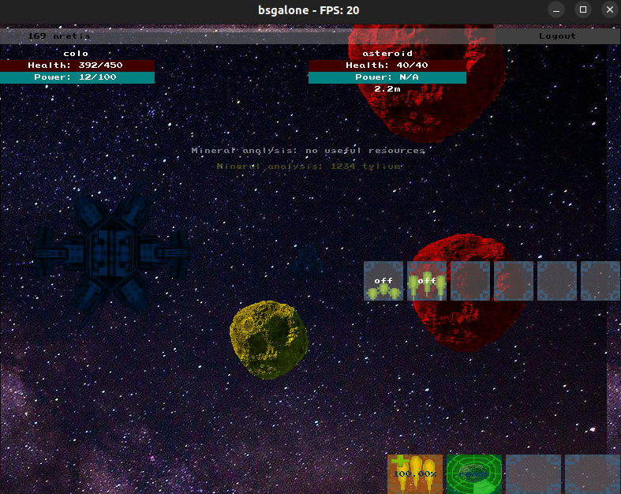
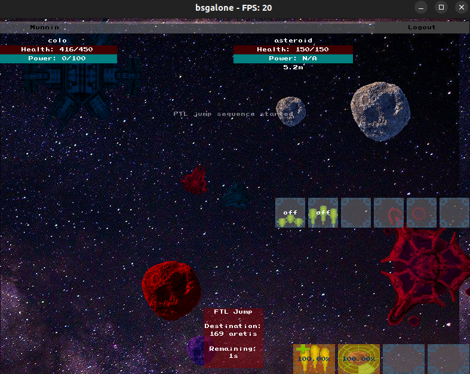
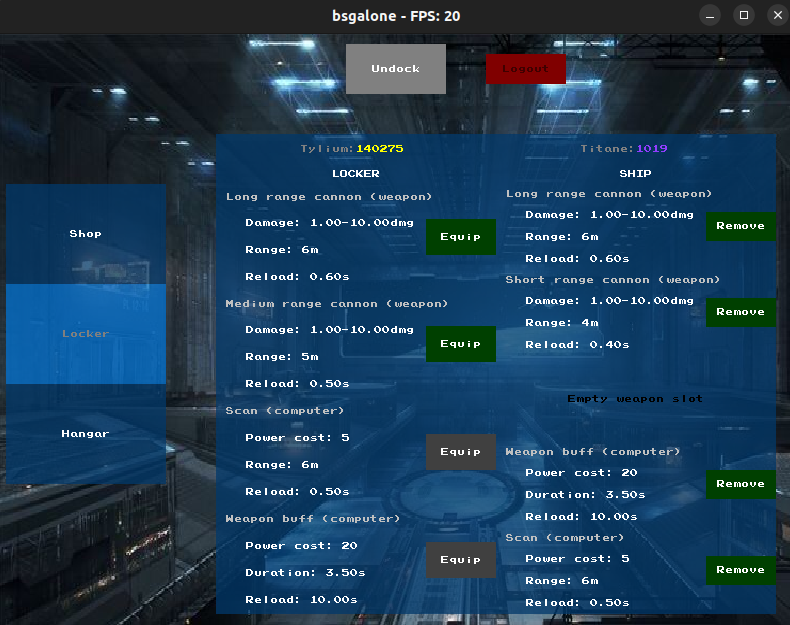
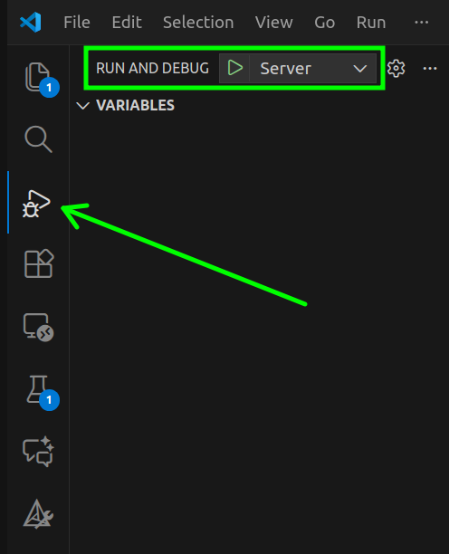
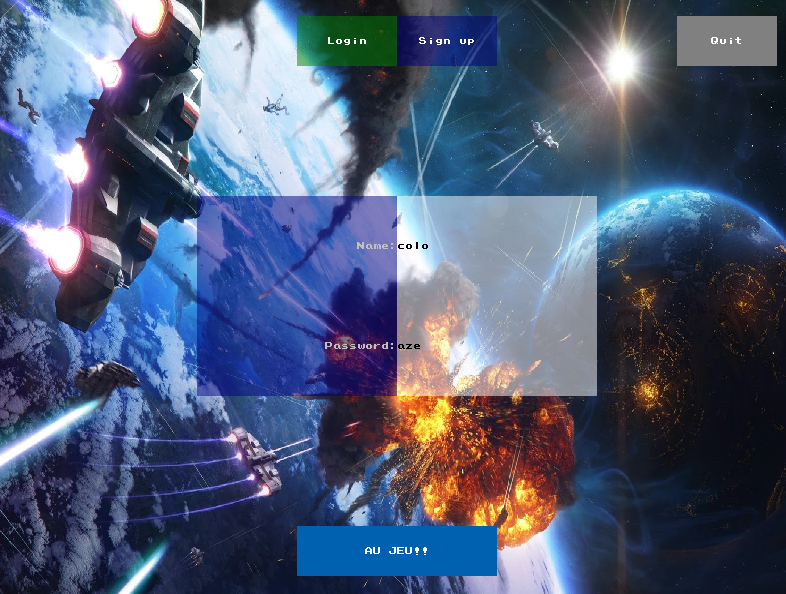

# bsgalone

This project aims at replicating the classic space shooter game [Battlestar Galactica Online](https://www.mmorpg.com/battlestar-galactica-online). It is not meant as a commercial project.

# What is the game about?

The goal is to have a 2d top view space shooter where the user can travel from systems to systems and fight enemies while mining resources and upgrading their ship.

Multiple players can connect to a ever-running server and compete or band together to play the game. Below are a few screenshots of the progress achieved during the development.

## Some visuals







## Why this project?

The goal of this project is to take inspiration from BSGO and copy some of the patterns used in it and also incorporate some original elements when they make sense.

As a personal project it is also a very good opportunity to get some hands-on experience with multi-player game development: it is a very interesting experience to get a feeling for the variety of problems that come with such an architecture.

## What works?

As of the time of writing, the game offers:

- a persistent registration/log in system
- a persistent server to which clients can connect to
- clear separation of concerns where the client applications do not access the DB

## Limitations

Some known limitations:

- no real game

# Badges

[](https://github.com/Knoblauchpilze/bsgalone/actions/workflows/build-ci-docker-image.yml)

[](https://github.com/Knoblauchpilze/bsgalone/actions/workflows/database-migration-tests.yml)

[](https://github.com/Knoblauchpilze/bsgalone/actions/workflows/build-and-push.yml)

[](https://codecov.io/gh/Knoblauchpilze/bsgalone)

# Installation

⚠️ The following sections are tailored for an installation on Ubuntu: this is what was used during the development. If you want to try to install it on another OS it probably works but some of the command will need to be adapted.

If you do so, please consider contributing the guide as an issue to help fellow developers!

## Prerequisites

This projects uses (among other things):

- [cmake](https://cmake.org/) as a build management system
- [ccache](https://ccache.dev/) as a wrapper to speed up the building process
- [asio](https://think-async.com/Asio/) as a networking library
- [postgresql](https://www.postgresql.org/) to create a database server
- [libpqxx](https://github.com/jtv/libpqxx) to establish database connections in the applications
- [golang migrate](https://github.com/golang-migrate/migrate/blob/master/cmd/migrate/README.md), to handle database migrations: following the instructions there should be enough
- a cpp compiler, typically [gcc](https://gcc.gnu.org/) to build the project
- [eigen](https://eigen.tuxfamily.org/index.php?title=Main_Page) for matrix manipulation
- [google test](https://github.com/google/googletest) as a testing library
- graphical libraries such as `X11`, `GL` and `PNG` for rendering
- [rsync](https://linux.die.net/man/1/rsync) for file management
- [urlencode](https://manpages.ubuntu.com/manpages/jammy/man1/urlencode.1.html) to handle escaping characters in passwords

## TL; DR

For a quick setup, just run the following commands to install all needed dependencies:

```bash
apt update

# Skip this if you already have the basics installed
apt install -y --no-install-recommends \
  cmake \
  build-essential \
  ccache

# To not request information when installing libgl-dev
export DEBIAN_FRONTEND="interactive"

# Those are the dependencies to compile the client and server applications
apt-get install -y --no-install-recommends \
  libasio-dev \
  libpqxx-dev \
  libeigen3-dev \
  libgtest-dev \
  libgmock-dev \
  libx11-dev \
  libgl-dev \
  libpng-dev \
  rsync \
  gridsite-clients

# Install migration tool, consider replacing the os and version
curl -L https://github.com/golang-migrate/migrate/releases/download/v4.18.3/migrate.linux-386.tar.gz | tar xvz
sudo cp migrate /usr/local/bin
```

**Note:** in case you're facing problem with installing one library or with compiling (see [section](#running-the-game-locally)), please refer to the following sections for library specific instructions. In case you face a unique problem, don't hesitate to open an [issue](https://github.com/Knoblauchpilze/bsgalone/issues).

**Note:** this project uses `-fprofile-update=atomic` as a profiling option to handle concurrency during profiling. This requires ccache [4.10.0](https://ccache.dev/releasenotes.html#_ccache_4_10) at least. In case your system comes with an older version it means that you won't benefit from having `ccache`.

**Note:** this project uses cpp20 and relies on features such as concepts. This should be supported by gcc10 (see [source](https://gcc.gnu.org/projects/cxx-status.html)). The development was made using gcc13. In case your version of gcc is older than this, refer to [this guide](https://www.dedicatedcore.com/blog/install-gcc-compiler-ubuntu/) to get an idea on how to install a more recent version.

## Clone the repository

The first step (as is often the case) if you want to work on this project is to clone the repository with:

```bash
git clone git@github.com:Knoblauchpilze/bsgalone.git
# Move to the project's folder
cd bsgalone
```

## libpqxx

This library is available in the package manager for Ubuntu. That being said, it is a bit tricky to get it working. It boils down to an important fix in [7.9.0](https://github.com/jtv/libpqxx/releases/tag/7.9.0) which allows the library to be used also with projects that don't use the same cpp version (see also issue [#732](https://github.com/jtv/libpqxx/issues/732)).

Notably, this project uses c++20 which can cause problem. In case you're unlucky and the version shipped with your package manager does not work, you can try to compile the library from source.

Additionally, the CI uses the `ubuntu:24.04` runner image which ships with [CMake 3.31.6](https://github.com/actions/runner-images/blob/main/images/ubuntu/Ubuntu2404-Readme.md#tools): this generates some error with version `7.9.1` (see issue [#851](https://github.com/jtv/libpqxx/issues/851)). Therefore we bumped all the way to `7.10.1` (the most recent at the time of writing).

The first step is to install `libpq`: it's automatically installed as part of `libpqxx` but not if you compile the library from source. You can run:

```bash
sudo apt install -y libpq-dev
```

**Note:** this is already handled in the CI runner and therefore we don't need to install it there.

Loosely based on what is described in the [README](https://github.com/jtv/libpqxx/blob/master/BUILDING-cmake.md#building-and-installing-libpqxx-yourself) and in the [cheat sheet](https://github.com/jtv/libpqxx/blob/master/BUILDING-cmake.md#cheat-sheet) for the build options, you can run the following commands:

```bash
cd /tmp
git clone https://github.com/jtv/libpqxx.git
cd libpqxx
git checkout 7.10.1
cmake \
  -DCMAKE_CXX_STANDARD=20 \
  -DCMAKE_BUILD_TYPE=Release \
  -DBUILD_SHARED_LIBS=1 \
  .
cmake --build . -j 8
sudo cmake --install .
```

This should have installed the version `7.10.1` of `libpqxx` under `/user/local/include/pqxx`.

## asio

This project uses the `asio` library for networking. There are two ways to install it: either using the version available in the packages. At the time of writing with Ubuntu 20.04 the packaged version is `1.18.1` which is quite old (2020). If you choose to do so, you can run:

```bash
apt-get install libasio-dev
```

You can also download the sources directly from the [official website](https://think-async.com/Asio/) (click on `Downloads`). This gives version `1.30.2` (at the time of writing).

**Note:** the development process used version `1.28`.

The download process gives a `tar.bz2` file which can be extracted with (change the version as needed) and installed:

```bash
tar -xvjf asio-1.28.0.tar.bz2
sudo mkdir /usr/local/include/asio
sudo cp -r asio-1.28.0/include/* /usr/local/include/asio
```

You can remove the `Makefile.am` and `Makefile.in` files from this directory to not pollute the includes.

## postgresql

To install postgresql we can simply rely on the packages and run the following:

```bash
sudo apt-get install postgresql-14
```

The version may vary. `14` is the one we used for development but it should not be an issue to pick another one.

## PixelGameEngine

The application is built around the [PixelGameEngine](https://github.com/OneLoneCoder/olcPixelGameEngine). We found it is a reliable engine to create 2D applications and display some graphics. However, there are a couple of compilation problems when we add the typical options we use (such as `-Wall` and `-Werror`) due to the `#ifdef` directives to support multiple platforms.

We isolated the `PixelGameEngine` into its own library in [src/pge](src/pge) and abstracted the use of the graphic resources and rendering elements into it. This is not 100% enough as we still get some errors when compiling the library. We allowed unknown pragmas and fixed the unused parameters manually in [fa73574](https://github.com/Knoblauchpilze/bsgalone/commit/fa73574d0cd47cea663305058f257abad7e1ce7e).

Additionally the application does not define a very nice icon nor tooltip. This was changed directly in the [PixelGameEngine](src/pge/olc/olcPixelGameEngine.h) file in [28590d1](https://github.com/Knoblauchpilze/bsgalone/commit/28590d182a35e3977f3221c7991a6be6b2169241).

In case of a future update we can port those changes or adapt them.

Additionally, the engine requires a couple of graphic libraries to be installed on the system to properly function. Those are:

- `x11` (Ubuntu package: `libx11-dev`)
- `GL` (Ubuntu package: `libgl-dev`)
- `png` (Ubuntu package: `libpng-dev`)

They should be available in most package managers.

## VScode configurations

### Extensions

In order to make it easy to debug and work on the project directly into the IDE, the following two extensions are recommended:

- [cmake-tools](https://marketplace.visualstudio.com/items?itemName=ms-vscode.cmake-tools)
- [test-mate](https://marketplace.visualstudio.com/items?itemName=matepek.vscode-catch2-test-adapter)

They will respectively help you build the project and debug/start it in your IDE and allow to run and debug tests.

The following sections assume that you installed both.

### Configuration for intellisense

In case you use VScode as an IDE to work on this project, it is recommended to create a `.vscode` folder at the root of the directory. You can then copy past the following configuration in a `c_cpp_properties.json` file:

```json
{
  "configurations": [
    {
      "name": "Linux",
      "includePath": [
        "${workspaceFolder}",
        "/usr/local/include",
        "/usr/include"
      ],
      "defines": [],
      "compilerPath": "/usr/bin/g++",
      "cppStandard": "c++20",
      "intelliSenseMode": "linux-gcc-x64",
      "configurationProvider": "ms-vscode.cmake-tools"
    }
  ],
  "version": 4
}
```

Note that this will require you to have a local `g++` version supporting at least `c++20`. You can find more information about the syntax for this file in the [documentation](https://code.visualstudio.com/docs/cpp/customize-cpp-settings#_browse-properties).

### Configuration for CMake

The `cmake` tool extension allows to configure a custom build folder and to set arguments for the configure step. This project defines conditional targets to build the tests: this is activated (as defined in the [Makefile](Makefile)) by the `ENABLE_TESTS` flag.

It is required to instruct the extension to use this flag when configuring the project so that it detects correctly all the target.

You can use the following configuration and paste it in the `.vscode` folder created above under `settings.json`:

```json
{
  "cmake.configureOnOpen": false,
  "cmake.buildDirectory": "${workspaceFolder}/cmake-build/Debug",
  "cmake.configureArgs": ["-DENABLE_TESTS=ON"],
  "testMate.cpp.discovery.gracePeriodForMissing": 500,
  "testMate.cpp.discovery.runtimeLimit": 500,
  "testMate.cpp.test.advancedExecutables": [
    {
      "pattern": "cmake-build/**/*{test,Test,TEST}*"
    }
  ],
  "C_Cpp.errorSquiggles": "enabled",
  "C_Cpp.default.compilerPath": "/usr/bin/g++"
}
```

### Launch/debug configuration

In order to run and debug the executables created by the project you can use the following launch configurations: the two configurations will allow to launch either the server or the client application and allow to debug them directly in the IDE if needed. You can paste the following content in a file under `.vscode/launch.json`:

```json
{
  "version": "0.2.0",
  "configurations": [
    {
      "name": "Server",
      "type": "cppdbg",
      "request": "launch",
      "program": "${workspaceFolder}/cmake-build/Debug/bin/bsgalone_server",
      "args": [],
      "stopAtEntry": false,
      "cwd": "${workspaceFolder}",
      "environment": [
        {
          "name": "PORT",
          "value": "2323"
        }
      ],
      "externalConsole": false,
      "MIMode": "gdb",
      "setupCommands": [
        {
          "description": "Enable pretty-printing for gdb",
          "text": "-enable-pretty-printing",
          "ignoreFailures": true
        },
        {
          "description": "Set Disassembly Flavor to Intel",
          "text": "-gdb-set disassembly-flavor intel",
          "ignoreFailures": true
        }
      ]
    },
    {
      "name": "Client",
      "type": "cppdbg",
      "request": "launch",
      "program": "${workspaceFolder}/cmake-build/Debug/bin/bsgalone_client",
      "args": [],
      "stopAtEntry": false,
      "cwd": "${workspaceFolder}",
      "environment": [
        {
          "name": "PORT",
          "value": "2323"
        }
      ],
      "externalConsole": false,
      "MIMode": "gdb",
      "setupCommands": [
        {
          "description": "Enable pretty-printing for gdb",
          "text": "-enable-pretty-printing",
          "ignoreFailures": true
        },
        {
          "description": "Set Disassembly Flavor to Intel",
          "text": "-gdb-set disassembly-flavor intel",
          "ignoreFailures": true
        }
      ]
    }
  ]
}
```

This should allow you to pick the `Server` configuration win the `RUN AND DEBUG` tab:



# Setting up the DB

## Generalities

The game uses data saved in a database to define elements of the gameplay. In order to do this we rely on a database being created and populated with data. The database is then accessed both by the client and the server through the same user.

## How to send commands to the postgres server

In order to create the database and then perform the migration, we need to use at least once the default `postgres` user to create a new one. This new user will then be used to perform all the rest.

On first inspection it seems like to do that we need to authenticate with the `postgres` user. The first thing which was not working as easily as we thought is that running the default `psql` command is trying to connect using Unix sockets which are apparently configured to use peer authentication. This can be checked in the file `/etc/postgresql/14/main/pg_hba.conf`:

```
local   all             postgres                                peer
```

According to this [Stack Overflow post](https://stackoverflow.com/questions/66915087/postgresql-psql-error-fatal-peer-authentication-failed-for-user-userrole) a way to change this behavior is either to change the `peer` value to something else or to use TCP for example by adding `-h 127.0.0.1` or `-h localhost` as an option of the command line.

## Altering the postgres password

The second problem that arised was that once we were able to communicate with TCP, we were prompted the `postgres` user password. This is not known to us. This [Stack Overflow post](https://stackoverflow.com/questions/27107557/what-is-the-default-password-for-postgres) provided useful guidance to change it to something we know.

## Creating the database

Once all of the above is done, we can successfully run the provided scripts to create a user (see [create_user.sh](database/create_user.sh)) first and then use this user to create the database with [create_database.sh](database/create_database.sh).

Both scripts expect a path to be given as argument: this should be the path to the folder containing the migrations and scripts. In this repository it is in [database/bsgalone](database/bsgalone).

Additionally, creating the users for the database follows a similar procedure are described in the [galactic-sovereign](https://github.com/Knoblauchpilze/galactic-sovereign?tab=readme-ov-file#creating-the-database) project.

In summary, you can prepare the database for the game with the following commands:

```bash
cd database
export ADMIN_PASSWORD=admin_password
export MANAGER_PASSWORD=manager_password
export USER_PASSWORD=user_password
./create_user.sh bsgalone
./create_database.sh bsgalone
```

There's also a convenience script provided in [scripts/setup_database.sh](scripts/setup_database.sh) which will run all the commands for you. Just run:

```bash
./scripts/setup_database.sh
```

## Populating the database

Managing the database and performing data migration is done through a tool called `migrate` (see [prerequisites](#prerequisites)). Once the previous step is complete (so the user and the database both exist) one can simply go to the [migrations](database/bsgalone/migrations) folder and run:

```bash
make migrate
```

**On a fresh database**, this will trigger all the migrations in order. If the database is in an intermediate state then it will only run the missing migrations.

## Managing the database

Once the database is created, it is easy to add migration files in the folder and run again `make migrate` to apply them. If one of them needs to be reverted, `make demigrateO` can be used to undo the last migration while `make demigrate` will undo all the migrations and basically restore the database to its initial (empty) state.

## Drop the database

In case it is required to drop the database completely, a convenience script is available under [drop_database.sh](database/drop_database.sh). It is possible to recreate the database again by following the same procedure starting from the top [section](#creating-the-database).

You can additionally use [drop_user.sh](database/drop_user.sh) to drop all three users created by the service. This is usually not necessary.

## Creating migrations and generating uuids

According to this [Stack Overflow](https://stackoverflow.com/questions/72144228/sequelize-migration-throws-error-function-uuid-generate-v4-does-not-exist) question it seems like we can directly use `gen_random_uuid` with versions of postgres more recent than 14. This is our case.

Another approach as we need to deserialize the data from the database is to use plain integers for identifiers. This is probably enough for now. To this end it seems like the way to go about it is to use `generated always as identity` (taken from this [Stack Overflow](https://stackoverflow.com/questions/55300370/postgresql-serial-vs-identity) post).

## Allowing clients to connect to the database

As of now each client will connect to the database and try to get information from it. This is mainly the case when processing messages and initializing the UI.

By default postgres does not allow incoming connections from remote host to come through. In order to allow the host machine to accept those we need to modify the configuration of the postgres a bit.

Once again we found a nice [Stack Overflow](https://stackoverflow.com/questions/17838613/open-port-in-ubuntu) post explaining what needs to be done. The steps are presented in the following sections.

### Edit: postgresql.conf

Edit the file:

```bash
sudo nano /etc/postgresql/<version>/main/postgresql.conf
```

And enable or add:

```
listen_addresses = '*'
```

### Edit pg_hba.conf

Edit the file:

```bash
sudo nano /etc/postgresql/<version>/main/pg_hba.conf
```

Register the network mask you want to allow connections from. A `0` stands for a wildcard and we chose to restrict to local network for now by adding the following:

```
host    all             all             192.168.1.0/0          scram-sha-256
```

The connection method was changed from `md5` to `scram-sha-256` as recommended by this [DBA stackexchange](https://dba.stackexchange.com/questions/83984/connect-to-postgresql-server-fatal-no-pg-hba-conf-entry-for-host) post: it is supposed to be more secured than the old `md5` approach.

With this we were able to connect from a remote computer to the database hosted on another machine.

# Running the game locally

When all the steps above have been successfully completed you can simply start the game locally. You will need two different terminals. The [Makefile](Makefile) defines useful commands to ease the process:

```bash
# in one terminal
make runserver

# in a second terminal
make runclient
```

If everything goes well you should see some logs appearing in both terminals and a window looking like the one below appear:



# Client/Server architecture

**Note:** this section is a draft and needs to be refined.

The approach to the communication between the client/server and the routing within each application is presented in the diagram below:


# Notes

## DB cheat sheet

A collection of useful sql queries we used extensively during development process.

```sql
select ss.ship, p.id as player, ss.docked, ss.system, sj.system, ps.hull_points, p.name from ship_system ss left join ship_jump sj on sj.ship = ss.ship left join player_ship ps on ss.ship = ps.id left join player p on ps.player = p.id where p.name in ('colo', 'colo2');
```

```sql
update player_ship set hull_points = 370 where ship = 1;
```

```sql
update ship_system set docked=true where ship in ('1', '5', '4');
```

# Future work

## Libraries

The [nlohmann json](https://github.com/nlohmann/json) is a quite famous library to handle json for C++. This might come in handy in the future if we need to introduce json in the project.

## Links

During the research on how to implement an ECS, we stumbled upon [this link](https://austinmorlan.com/posts/entity_component_system/). It seems more advanced: it might be interesting to come back to it later if the current system does not bring satisfaction anymore.

Regarding the general topic of client/server architecture we found this [medium article](https://medium.com/swlh/building-a-realtime-multiplayer-browser-game-in-less-than-a-day-part-3-4-ede95eb924a0) about building a game in less than a day. This [youtube series](https://www.youtube.com/playlist?list=PLZ-54sd-DMAKU8Neo5KsVmq8KtoDkfi4s) by `Game Development Center` also seems to cover a lot of ground even though it is tailored to creating a game in Godot.

Another interesting extension would be to include handling of the physics maybe for acceleration and moving the ship in general but also maybe for handling collisions. We found the [Chipmunk2D](https://github.com/slembcke/Chipmunk2D) library and got recommended the [box2D](https://box2d.org/documentation/) project by a [colleague](https://github.com/Raduruse).
